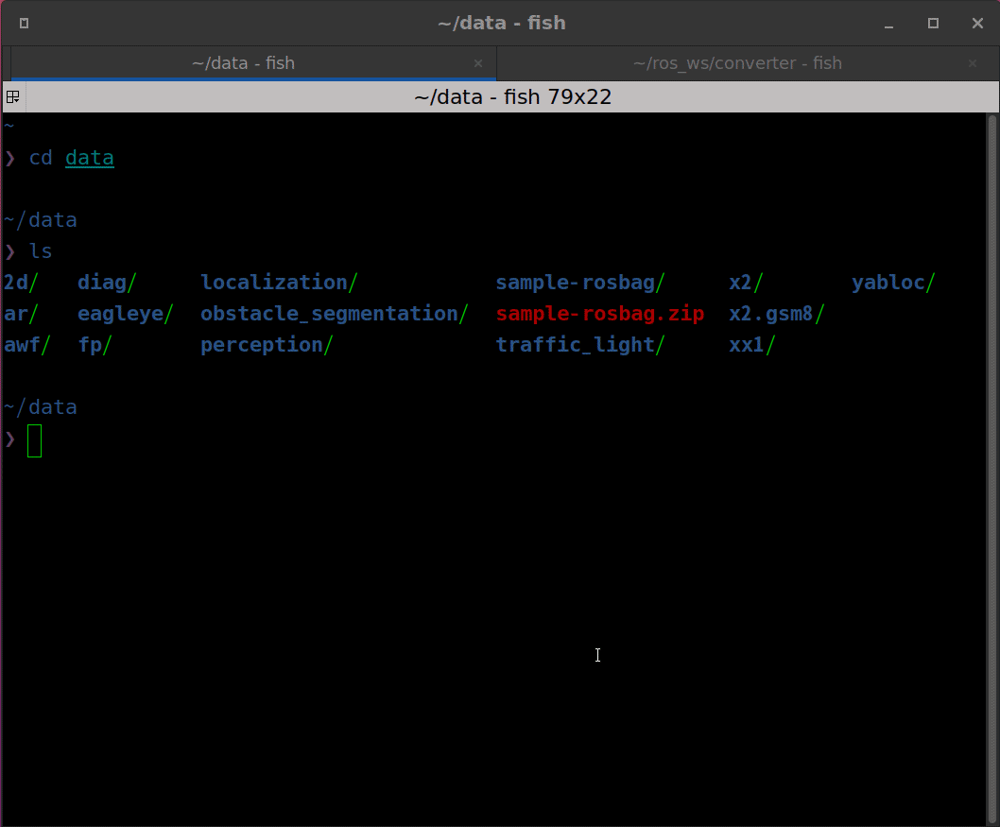

# autoware_msg_bag_converter

This package converts bag containing type autoware_auto_msg to autoware_msg.

## preparation

1. create ros2 workspace for converter (ex. $HOME/ros_ws/tools)
2. clone this repository into tools workspace
3. clone dependency repos
4. build converter workspace

Example command is below.

```shell
mkdir -p $HOME/ros_ws/tools/src
cd $HOME/ros_ws/tools/src
git clone https://github.com/autowarefoundation/autoware_tools.git
cd autoware_tools
vcs import . < build_dependency.repos
cd autoware_msg_bag_converter
vcs import .. < dependency.repos
cd $HOME/ros_ws/tools
colcon build --symlink-install --cmake-args -DCMAKE_EXPORT_COMPILE_COMMANDS=ON -DCMAKE_BUILD_TYPE=Release
```

## usage

```shell
cd $HOME/ros_ws/tools
source install/setup.bash
cd src/autoware_msg_bag_converter/autoware_msg_bag_converter

# convert one bag
python3 main.py ${input_bag} ${output_bag}

# convert multi bags in directory
python3 main.py ${input_bag_dir} ${output_bag_dir} -d
```

## demo


