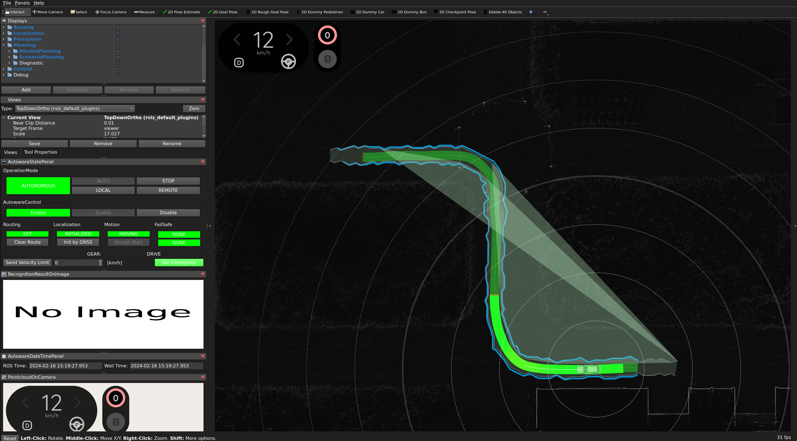

# bag2lanelet

This package generates a lanelet map necessary for Autoware's autonomous driving from rosbag data containing information about Localization (`/tf`). This enables autonomous driving based on manual driving information.

The provided functionalities are as follows:

- bag2lanelet.py: Generates lanelet (.osm) from a rosbag based on the position of `base_link`.
- bag2trajectory.py: Generates trajectory information (.csv) for vector_map_builder from a rosbag.

## Example

As an example, the process of lanelet generation based on driving trajectories from the planning simulator is performed as follows. Typically, the expectation is to use rosbag data from manual driving, rather than from the planning simulator.

Firstly, you need to run the planning_simulator following the [planning_simulator tutorial in Autoware Documentation](https://autowarefoundation.github.io/autoware-documentation/main/tutorials/ad-hoc-simulation/planning-simulation/). The process would be, install Autoawre, download the maps, run the planning_simulator, and start autonomous driving. Make sure to save the rosbag during this driving session using the following command:

```sh
ros2 bag record /tf -o /tmp/bag2lanelet_sample.bag
```

<p align="center">
  
</p>

After completing the drive, you can run the `bag2lanelet.py` script. This requires specifying the output directory, lane width and MGRS coordinates:

```sh
./bag2lanelet.py /tmp/bag2lanelet_sample.bag /tmp/bag2lanelet_sample -l 3.0 -m 54SUE
```

The map will be saved in the specified directory, following the naming convention `<date>-lanelet2_map.osm`. The map generated will appear like this. You can see the example result in [./example/lanelet2_map.osm](./example/lanelet2_map.osm).

When you relaunch the planning_simulator with the new lanelet2 map, you will see the following.

<p align="center">
  
</p>

Please note that at this stage, although this map works with Autoware, the shape of the lanes will appear jagged. (Refer to the 'Limitations' section for more details.) While this is an issue that should be addressed in the future, it can currently be resolved by loading it in [Vector Map Builder](https://autowarefoundation.github.io/autoware-documentation/main/how-to-guides/integrating-autoware/creating-maps/creating-vector-map/#vector-map-builder) as follows.

Following the documentation of the [Vector Map Builder](https://autowarefoundation.github.io/autoware-documentation/main/how-to-guides/integrating-autoware/creating-maps/creating-vector-map/#vector-map-builder), import the generated Lanelet2 map. You can see the refined lane on the application.

<p align="center">
  
</p>

Then, Export the map. You can run the planning_simulator with the refined lanelet2 map and see how it goes on the Rviz.

<p align="center">
  
</p>

## Requirements

```sh
sudo apt update
sudo apt install ros-humble-tf-transformations ros-humble-tf-transformations
pip install -r requirements.txt
```

## Usage

Check `./bag2lanelet.py --help`

### generate lanelet2 file

```sh
./bag2lanelet.py /home/autoware/rosbag/sample . --width=3.0
```

or with MGRS code at Monza Track

```sh
./bag2lanelet.py /home/autoware/rosbag/sample . --width=3.0 --mgrs 32TNR219517
```

### generate trajectory file for Vector Map Builder

```sh
./bag2trajectory.py /home/autoware/rosbag/sample sample.csv
```

## Limitations

Here is the limitations of this package. Contributions to further improvements are more than welcome.

- Due to the low conversion accuracy from MGRS to latitude and longitude in this script, the lanes in the output lanelet.osm appear jagged. Importing and then exporting through vector_map_builder corrects these values with high accuracy.
