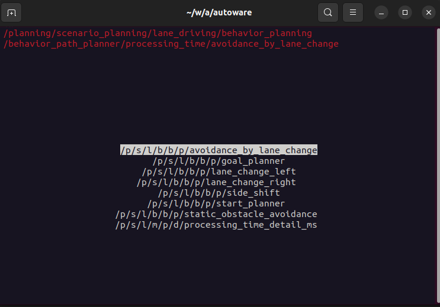
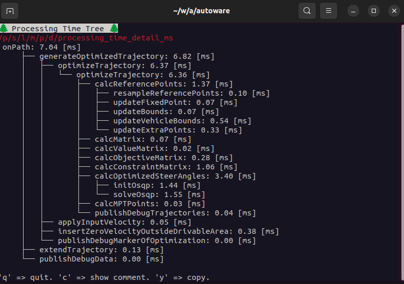
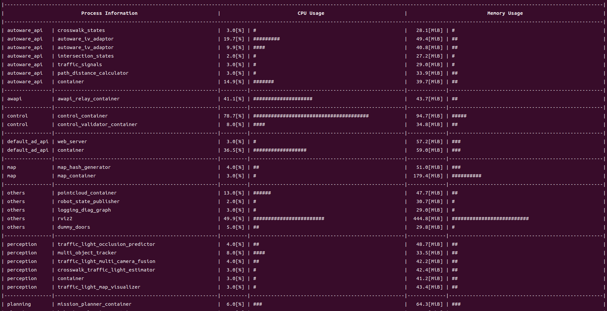

# Autoware Debug Tools

This package provides tools for debugging Autoware.

## Processing Time Visualizer

This tool visualizes `tier4_debug_msgs/msg/ProcessingTimeTree` messages.

### Usage

1. Run the following command to start the visualizer.

   ```bash
   ros2 run autoware_debug_tools processing_time_visualizer
   ```

2. Select a topic to visualize.

   

3. Then, the visualizer will show the processing time tree.

   

## System Usage Monitor

The purpose of the System Usage Monitor is to monitor, visualize and publish the CPU usage and memory usage of the ROS processes. By providing a real-time terminal-based visualization, users can easily confirm the cpu and memory usage as in the picture below.



You can run the program by the following command.

```bash
ros2 run autoware_debug_tools system_usage_monitor
```
