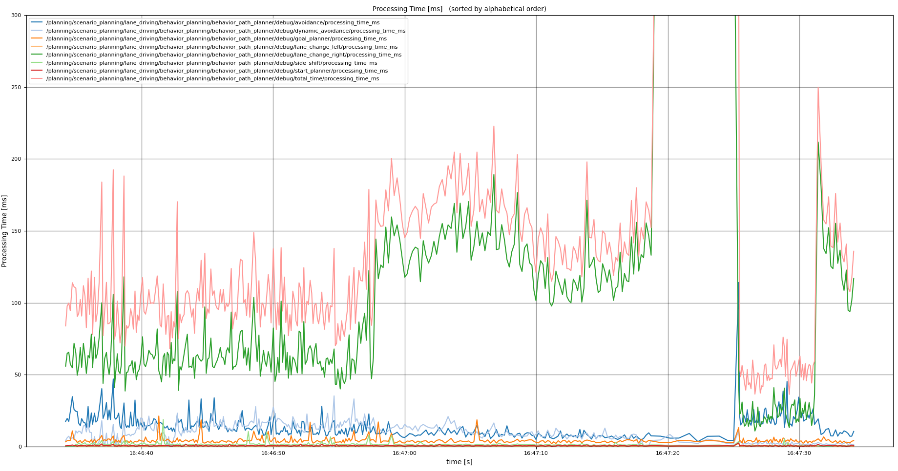
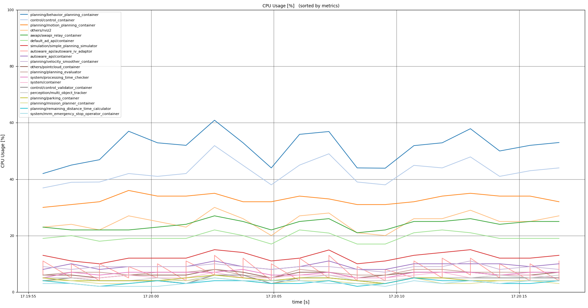
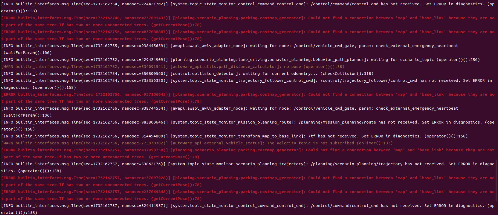

# Autoware Debug Tools

This package provides tools for debugging Autoware.

## Processing Time Visualizer

This tool visualizes `tier4_debug_msgs/msg/ProcessingTimeTree` messages.

### Usage

1. Run the following command to start the visualizer.

   ```bash
   ros2 run autoware_debug_tools processing_time_visualizer
   ```

2. Select a topic to visualize.

   

3. Then, the visualizer will show the processing time tree.

   

#### summarized output

Running with `--summarize`, it will output the summarized information.

```Text
> ros2 run autoware_debug_tools processing_time_visualizer --summarize

objectsCallback: 17.99 [ms], run count: 1
    ├── removeStaleTrafficLightInfo: 0.00 [ms], run count: 1
    ├── updateObjectData: 0.03 [ms], run count: 13
    ├── getCurrentLanelets: 4.81 [ms], run count: 13
    │   ├── checkCloseLaneletCondition: 2.43 [ms], run count: 130
    │   ├── isDuplicated: 0.02 [ms], run count: 17
    │   └── calculateLocalLikelihood: 0.66 [ms], run count: 12
    ├── updateRoadUsersHistory: 0.30 [ms], run count: 13
    └── getPredictedReferencePath: 5.47 [ms], run count: 5
        ├── predictObjectManeuver: 0.40 [ms], run count: 5
        │   └── predictObjectManeuverByLatDiffDistance: 0.34 [ms], run count: 5
        │       └── calcRightLateralOffset: 0.03 [ms], run count: 12
        ├── calculateManeuverProbability: 0.01 [ms], run count: 5
        └── addReferencePaths: 4.66 [ms], run count: 15
            ├── updateFuturePossibleLanelets: 0.08 [ms], run count: 8
            └── convertPathType: 4.29 [ms], run count: 8

```

## System Usage Monitor

The purpose of the System Usage Monitor is to monitor, visualize and publish the CPU usage and memory usage of the ROS processes. By providing a real-time terminal-based visualization, users can easily confirm the cpu and memory usage as in the picture below.


You can run the program by the following command.

```bash
ros2 run autoware_debug_tools system_usage_monitor
```

## System Performance Plotter

This script plots the following metrics by each Autoware's module.

- processing time
- CPU usage
- memory usage

### Usage

Run the following commands according to your purpose.

```bash
# plot processing time
ros2 run autoware_debug_tools processing_time_plotter <bag-path>

# plot CPU usage
ros2 run autoware_debug_tools cpu_usage_plotter <bag-path>

# plot memory usage
ros2 run autoware_debug_tools memory_usage_plotter <bag-path>
```

There are several options.

- `-c`:
  - can filter modules in the specific component (e.g. `all`, `planning`, `system`, etc).
- `-n <number>`:
  - can pick up top `<number>` critical modules.
- `-g <text>`
  - can filter the modules which include `<text>`.
- `-y <val>`
  - can set the height of the plot to `<val>`.

### Examples

```bash
ros2 run autoware_debug_tools processing_time_plotter <bag-path> -c planning -g behavior_path -y 300
```



```bash
ros2 run autoware_debug_tools cpu_usage_plotter <bag-path> -n 20
```



## Rosout Log Reconstructor

This script shows the log from the `/rosout` topic on the terminal.

### Usage

```bash
ros2 run autoware_debug_tools rosout_log_reconstructor
```


