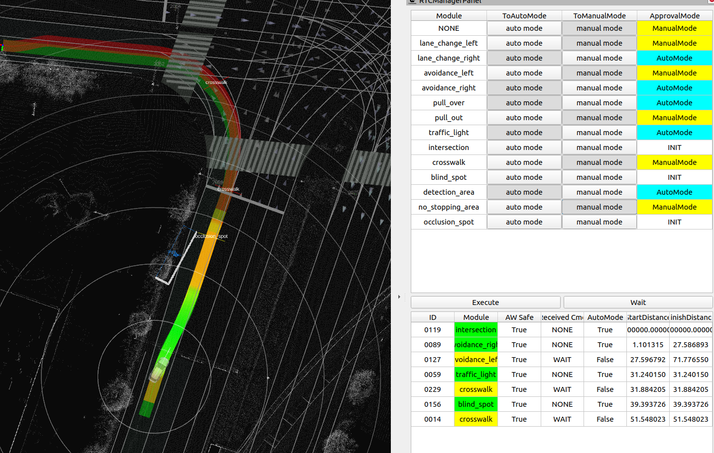
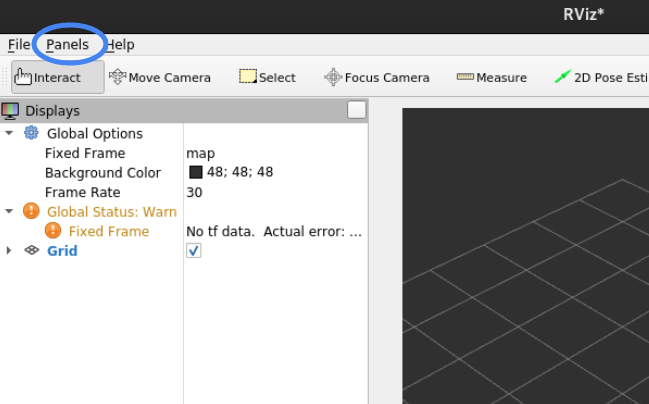

# rtc_manager_rviz_plugin

## Purpose

The purpose of this RViz plugin is to provide a graphical interface for managing RTC (Request To Cooperate) functionality:

1. Display RTC status for each cooperate module (ID, Module, Safe, Command, AutoMode, State, StartDistance, FinishDistance).
2. Switch each module between Auto mode and Manual mode.
3. Send cooperate commands by button (Activate the front module).

## Features

- **Auto Mode Panel**: Toggle visibility with "Show Auto Mode Panel" checkbox. Displays a table of modules with buttons to switch between Auto/Manual mode.
- **Status Table**: Shows real-time status of all RTC modules including distance information.
- **Activate Button**: Sends an ACTIVATE command to the nearest activatable module (modules that are not yet activated, not in auto mode, and have positive start distance).

## Inputs / Outputs

### Input

| Name                              | Type                                        | Description                             |
| --------------------------------- | ------------------------------------------- | --------------------------------------- |
| `/api/external/get/rtc_status`    | `tier4_rtc_msgs::msg::CooperateStatusArray` | The statuses of each Cooperate Commands |
| `/api/external/get/rtc_auto_mode` | `tier4_rtc_msgs::msg::AutoModeStatusArray`  | The auto mode statuses for each module  |

### Output

| Name                             | Type                                     | Description                                            |
| -------------------------------- | ---------------------------------------- | ------------------------------------------------------ |
| `/api/external/set/rtc_commands` | `tier4_rtc_msgs::srv::CooperateCommands` | The Cooperate Commands for each planning               |
| `/planning/enable_auto_mode/*`   | `tier4_rtc_msgs::srv::AutoMode`          | The service to switch Auto/Manual mode for each module |

## HowToUse

1. Start RViz and select Panels > Add New Panel.
   

2. Select rtc_manager_rviz_plugin/RTCManagerPanel and press OK.
   

3. The panel will appear with:
   - A checkbox to show/hide the Auto Mode Panel
   - Auto Mode Table (if visible) with buttons to switch each module between Auto/Manual mode
   - Status Table showing all RTC module statuses
   - Activate button to send ACTIVATE command to the front activatable module
