# Control data collecting tool

This package provides tools for automatically collecting data using pure pursuit control within a specified rectangular area.


## Overview

- This package aims to collect a dataset consisting of control inputs (i.e. `control_cmd`) and observation variables (i.e. `kinematic_state`, `steering_status`, etc).
- The collected dataset can be used as training dataset for learning-based controllers, including [smart_mpc](https://github.com/autowarefoundation/autoware.universe/tree/f30c0350861d020ad26a45806ab1334895122fab/control/smart_mpc_trajectory_follower).
- Data collecting approach is as follows:

  - Following the trajectory using a pure pursuit control law.
  - Adding noises to the trajectory and the control command for data diversity, improving the prediction accuracy of learning model.
  - Setting the trajectory from the following types of trajectories ( [`eight_course`, `u_shaped_return`, `straight_line_positive`, `straight_line_negative`, `reversal_loop_circle`, `along_road`] ).

    - `COURSE_NAME: eight_course`

      

    - `COURSE_NAME: u_shaped_return`

      

    - `COURSE_NAME: straight_line_positive` or `COURSE_NAME: straight_line_negative`

      ( Both "straight_line_positive" and "straight_line_negative" represent straight line courses, but the direction of travel of the course is reversed.)

      

    - `COURSE_NAME: reversal_loop_circle`

      Drive within a circle while adding trajectories and collect data.

      

    - `COURSE_NAME: along_road`

      Generate trajectories along the road. This is particularly useful when drawing long straight paths along the road.

      In this course, data collection is conducted only on long straight trajectories, while constant velocity, `velocity_on_curve`, is maintained when driving on sections that include curves.

      The minimum length of these long straight trajectories can be specified using the parameter `minimum_length_of_straight_line` (These two parameters `velocity_on_curve` and `minimum_length_of_straight_line` can be configured in `./config/course_param/along_road_param.yaml`).

      

## How to Use

<!-- prettier-ignore-start -->
<!-- Since markdownlint and prettier formats are different, use only markdownlint. -->

1. Launch Autoware.

    ```bash
    ros2 launch autoware_launch planning_simulator.launch.xml map_path:=$HOME/autoware_map/sample-map-planning vehicle_model:=sample_vehicle sensor_model:=sample_sensor_kit
    ```

2. Set an initial pose, see [here](https://autowarefoundation.github.io/autoware-documentation/main/tutorials/ad-hoc-simulation/planning-simulation/#2-set-an-initial-pose-for-the-ego-vehicle).

3. Add the DataCollectingAreaSelectionTool and DataCollectingGoalPlugin RViz plugins by clicking the "+" icon at the top of the RViz window. <br> 

4. Launch control_data_collecting_tool.

    ```bash
    ros2 launch control_data_collecting_tool control_data_collecting_tool.launch.py map_path:=$HOME/autoware_map/sample-map-planning accel_brake_map_path:=/path/to/your/accel_brake_map_dir
    ```

    - If you use the `along_road` course, please specify the same map for `map_path` as the one used when launching Autoware. `map_path` is not necessary when using courses other than `along_road`.

    - If you set CONTROL_MODE to actuation_cmd or external_actuation_cmd, please specify the directory where the accel/brake maps used by your control system are located.

    - Control data collecting tool automatically records topics included in `config/topics.yaml` when the above command is executed. Topics will be saved in rosbag2 format in the current directory.

    - The data from `/localization/kinematic_state` and `/localization/acceleration` located in the directory (rosbag2 format) where the command is executed will be automatically loaded and reflected in the data count for these topics.
      (If `LOAD_ROSBAG2_FILES` in `config/param.yaml` is set to `false`, the data is not loaded.)

5. Add visualization in rviz:

    - `/data_collecting_area`
      - Type: Polygon
    - `/data_collecting_trajectory_marker_array`
      - Type: MarkerArray
    - `/data_collecting_lookahead_marker_array`
      - Type: MarkerArray

6. The following actions differ depending on the selected course. If you select the trajectory from [`eight_course`, `u_shaped_return`, `straight_line_positive`, `straight_line_negative`, `reversal_loop_circle`], please proceed to 6.1. If you select the trajectory from [`along_road`], please proceed to 6.2.

    - 6.1 If you choose the trajectory from [`eight_course`, `u_shaped_return`, `straight_line_positive`, `straight_line_negative`, `reversal_loop_circle`], select `DataCollectingAreaSelectionTool` plugin.

      

      Highlight the data collecting area by dragging the mouse over it.

      

      > [!NOTE]
      > You cannot change the data collecting area while driving.

    - 6.2 If you choose the trajectory from [`along_road`], select `DataCollectingGoalPose` plugin.

        

      By setting the pose of the goal point, a trajectory is generated on the map.

        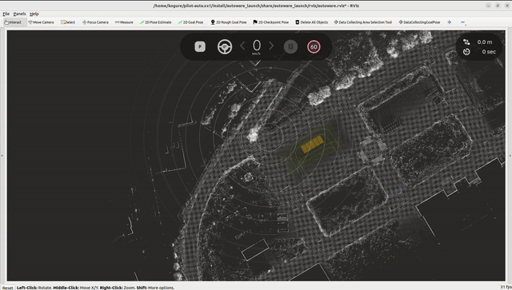

      As soon as the trajectory is generated, the plot with the map and trajectory drawn on it will be created (please see the following picture).
      In the sections labeled `velocity = const (velocity_on_curve)` in the legend, the vehicle travels at a constant velocity of `velocity_on_curve`. In the sections labeled `Data collection is conducted`, data collection is performed.

        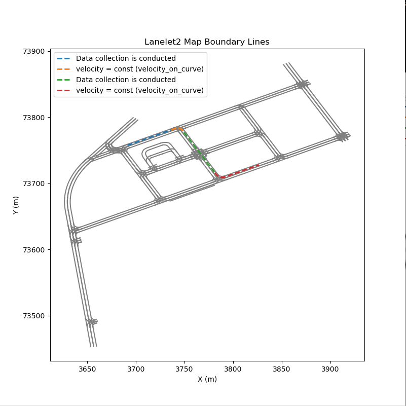

      > [!NOTE]
      > You cannot change the goal pose while driving.
      > In cases where course generation fails, which can happen under certain conditions, please reposition the vehicle or redraw the goal pose.

7. The following actions differ depending on the `CONTROL_MODE`. If you select the control mode from [ `acceleration_cmd`], please proceed to 7.1. If you select the control mode from [`actuation_cmd`], please proceed to 7.2. If you select the control mode from [`external_acceleration_cmd`, `external_actuation_cmd`], please proceed to 7.3.

    - 7.1 If you choose the control mode from [ `acceleration_cmd`], click the `LOCAL` button in `AutowareStatePanel`.

        

        Then, data collecting starts.

        

        You can monitor the data collection status in real-time through the window that pops up when this node is launched.
        (From top to bottom: the speed-acceleration phase diagram, the speed-acceleration heatmap, the speed-steering angle heatmap, the speed-steer rate heatmap, and the speed-jerk heatmap.)

        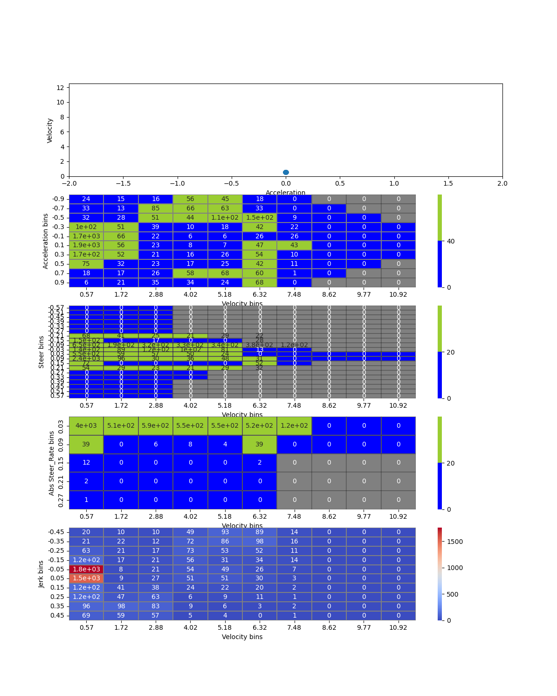

        For the speed-acceleration heatmap, speed-steering angle heatmap, and speed-steer rate heatmap, the collection range can be specified by the masks located in the folder `config/masks/MASK_NAME` where `MASK_NAME` is a parameter specifying mask name (Please also see `config/common_param.yaml`).
        The specified heatmap cells are designed to change from blue to green once a certain amount of data (`VEL_ACC_THRESHOLD`, `VEL_STEER_THRESHOLD`, `VEL_ABS_STEER_RATE_THRESHOLD` ) is collected. It is recommended to collect data until as many cells as possible turn green.

    - 7.2 If you choose the control mode from [`actuation_cmd`], click the LOCAL button in the AutowareStatePanel as described in Section 7.1.
      > [NOTE]
      > At this time, the control mode `actuation_cmd` is only implemented in the course `reversal_loop_circle` and cannot be used in other courses.

      This mode allows you to collect data on various accel and brake pedal inputs. To monitor the data collection status of accel/brake input, please use the functionality of [autoware_accel_brake_map_calibrator](https://github.com/autowarefoundation/autoware.universe/blob/main/vehicle/autoware_accel_brake_map_calibrator/README.md).

    - 7.3 In the case you choose the control mode from  [`external_acceleration_cmd`, `external_actuation_cmd`].

      - `external_acceleration_cmd`

        This mode enables the collection of constant acceleration data for both positive and negative acceleration scenarios.

        - Positive Acceleration Data Collection

          a. Start the Tool by using the following command

            ```bash
            ros2 run control_data_collecting_tool data_collecting_acceleration_cmd
            ```

          b. Confirm Data Collection: The tool prompts you to confirm whether to proceed with positive acceleration data collection:

            ```bash
            Do you want to collect constant positive acceleration cmd data? (yes/no)
            ```

          c. Input Acceleration: When prompted, input the desired acceleration value:

            ```bash
            Target acceleration [0.0 ~ 2.0 m/s^2]
            ```

          d. Gear Change and Readiness Check: Pleas click the `LOCAL` button in `AutowareStatePanel`  as in 7.1 and the tool checks if the system is ready for the operation. You will see the following prompt:

            ```bash
            Ready to drive? (yes/no)
            ```

          f. Execution and Recording: After 3-second counting, the vehicle accelerates to `TARGET_VELOCITY` specified in the configuration file. During this process, the following message is displayed:

            ```bash
            Accelerate with target_acceleration m/s^2
            ```

            A ROS bag file records all relevant topics during this session. The filename is generated as constant_acceleration_cmd_ACCEL_TARGET_ACCELERATION_CURRENT_TIME, where TARGET_ACCELERATION is input target acceleration value, and CURRENT_TIME is the timestamp in YYYYMMDD-HHMMSS format. The ROS bag file will specifically include topics matching the regular expression:

            ```bash
            /control/(.*)|/vehicle/(.*)|/imu/(.*)|/sensing/imu/(.*)
            ```

          g. Deceleration Phase: After reaching `TARGET_VELOCITY`, the tool applies a deceleration using the TARGET_ACCELERATION_FOR_BRAKE parameter to bring the vehicle to a stop.

          h. Completion: Once the data is recorded and the vehicle is safely stopped, the session ends. The tool validates the recorded data.

        - Negative Acceleration Data Collection

          a. Start the Tool by using the following command

            ```bash
            ros2 run control_data_collecting_tool data_collecting_acceleration_cmd
            ```

          b. Confirm Data Collection: The tool prompts you to confirm whether to proceed with negative acceleration data collection (the following message will be displayed after answering `no` to `Do you want to collect constant positive acceleration cmd data? (yes/no)` in Positive Acceleration Data Collection):

            ```bash
            Do you want to collect constant negative acceleration cmd data? (yes/no)
            ```

          c. Input Acceleration: When prompted, input the desired acceleration value:

            ```bash
            Target acceleration [-5.0 ~ 0.0 m/s^2]
            ```

          d. Gear Change and Readiness Check: Pleas click the `LOCAL` button in `AutowareStatePanel` as in 7.1 and the tool checks if the system is ready for the operation. You will see the following prompt:

            ```bash
            Ready to drive? (yes/no)
            ```

          e. Acceleration Phase: After 3-second counting, the vehicle accelerates to the `TARGET_VELOCITY` with TARGET_ACCELERATION_FOR_DRIVE before braking.

          f. Braking and Recording: Once `TARGET_VELOCITY` is achieved, the tool applies the braking command. During this process, you will see:

            ```bash
            Accelerate with target_acceleration m/s^2
            ```

            A ROS bag file records all relevant topics during this session. The filename is generated as constant_acceleration_cmd_BRAKE_TARGET_ACCELERATION_CURRENT_TIME, where TARGET_ACCELERATION is input target acceleration value, and CURRENT_TIME is the timestamp in YYYYMMDD-HHMMSS format. The ROS bag file will specifically include topics matching the regular expression:

            ```bash
            /control/(.*)|/vehicle/(.*)|/imu/(.*)|/sensing/imu/(.*)
            ```

          g. Completion: Once the data is recorded and the vehicle is safely stopped, the session ends. The tool validates the recorded data.

      - `external_actuation_cmd`

        This mode enables the collection of constant accel/brake pedal input data.

        - Accel Pedal Data Collection

          a. Start the tool by using the following command

            ```bash
            ros2 run control_data_collecting_tool data_collecting_actuation_cmd
            ```

          b. Confirm Data Collection: The tool prompts you to confirm whether to proceed with positive acceleration data collection:

            ```bash
            Do you want to accel pedal input data? (yes/no)
            ```

          c. Input Accel Pedal input: When prompted, input the desired accel pedal input value:

            ```bash
            Target accel pedal input [0.0 ~ 0.5 ]
            ```

          d. Gear Change and Readiness Check: Pleas click the `LOCAL` button in `AutowareStatePanel`  as in 7.1 and the tool checks if the system is ready for the operation. You will see the following prompt:

            ```bash
            Ready to drive? (yes/no)
            ```

          e. Execution and Recording: After 3-second counting, the vehicle accelerates to `TARGET_VELOCITY` specified in the configuration file. During this process, the following message is displayed:

            ```bash
            Actuate with accel pedal input: target_accel_pedal_input
            ```

            A ROS bag file records all relevant topics during this session. The filename is generated as constant_actuation_cmd_ACCEL_TARGET_ACCELERATION_CURRENT_TIME, where TARGET_ACCELERATION is input target acceleration value, and CURRENT_TIME is the timestamp in YYYYMMDD-HHMMSS format. The ROS bag file will specifically include topics matching the regular expression:

            ```bash
            /control/(.*)|/vehicle/(.*)|/imu/(.*)|/sensing/imu/(.*)
            ```

          f. Deceleration Phase: After reaching `TARGET_VELOCITY`, the tool applies a deceleration using the TARGET_ACTUATION_FOR_BRAKE parameter to bring the vehicle to a stop.

          g. Completion: Once the data is recorded and the vehicle is safely stopped, the session ends. The tool validates the recorded data.

        - Brake Pedal Data Collection

          a. Start the tool by using the following command

            ```bash
            ros2 run control_data_collecting_tool data_collecting_actuation_cmd
            ```

          b. Confirm Data Collection: The tool prompts you to confirm whether to proceed with brake pedal input data collection (the following message will be displayed after answering `no` to `Do you want to accel pedal input data? (yes/no)` in Accel Pedal Data Collection):

            ```bash
            Do you want to brake pedal input data? (yes/no)
            ```

          c. Input Brake Pedal input: When prompted, input the desired brake pedal input value:

            ```bash
            Target brake pedal input [0.0 ~ 0.8 ]
            ```

          d. Gear Change and Readiness Check: Pleas click the `LOCAL` button in `AutowareStatePanel` as in 7.1 and the tool checks if the system is ready for the operation. You will see the following prompt:

            ```bash
            Ready to drive? (yes/no)
            ```

          e. Acceleration Phase: After 3-second counting, the vehicle accelerates to the `TARGET_VELOCITY` with TARGET_ACTUATION_FOR_ACCEL before braking.

          f. Braking and Recording: Once `TARGET_VELOCITY` is achieved, the tool applies the braking command. During this process, you will see:

            ```bash
            Actuate with brake pedal input: target_brake_pedal_input
            ```

            A ROS bag file records all relevant topics during this session. The filename is generated as constant_actuation_cmd_ACCEL_TARGET_ACCELERATION_CURRENT_TIME, where TARGET_ACCELERATION is input target acceleration value, and CURRENT_TIME is the timestamp in YYYYMMDD-HHMMSS format. The ROS bag file will specifically include topics matching the regular expression:

            ```bash
            /control/(.*)|/vehicle/(.*)|/imu/(.*)|/sensing/imu/(.*)
            ```

          g. Completion: Once the data is recorded and the vehicle is safely stopped, the session ends. The tool validates the recorded data.

8. If you want to stop data collecting automatic driving, run the following command

    ```bash
    ros2 topic pub /data_collecting_stop_request std_msgs/msg/Bool "data: true" --once
    ```

    > [!NOTE]
    > When the car crosses the green boundary line, a similar stopping procedure will be automatically triggered.

9. If you want to restart data collecting automatic driving, run the following command

    ```bash
    ros2 topic pub /data_collecting_stop_request std_msgs/msg/Bool "data: false" --once
    ```

<!-- prettier-ignore-end -->

## Specify data collection range

You can create an original mask to specify the data collection range for the heatmap explained in step 7 of the "How to Use" section.

1. Change the `MASK_NAME` parameter in `config/common_param.yaml` from its default value of `default` to any name you prefer.

2. Modify parameters such as `VEL_ACC_THRESHOLD`, `VEL_STEER_THRESHOLD`, and `VEL_ABS_STEER_RATE_THRESHOLD` to determine the desired amount of data for each cell in the speed-acceleration heatmap, speed-steering angle heatmap, and speed-steer rate heatmap.

3. In the `scripts/masks` directory, run

   ```Python3
   python3 mask_selector.py
   ```

   then, matplotlib windows for selecting the collection range of the speed-acceleration heatmap, speed-steering angle heatmap, and speed-steer rate heatmap will be displayed, one for each.

   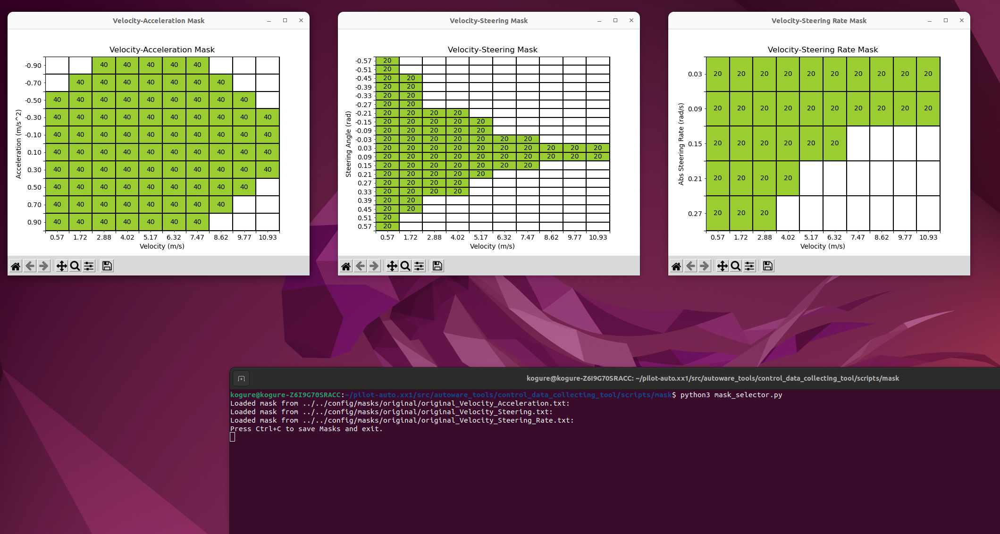

   In these windows, you can modify the heatmaps by clicking or dragging within them. Once you've made your changes, pressing `Ctrl+C` in the terminal will automatically save the updated maps.

   Afterward, rebuild the `control_data_collecting_tool` using the following command

   ```bash
   colcon build --cmake-args -DCMAKE_BUILD_TYPE=Release -DCMAKE_CXX_FLAGS="-w" --symlink-install --continue-on-error --packages-up-to control_data_collecting_tool
   ```

   and relaunch the control_data_collecting_tool with

   ```bash
   ros2 launch control_data_collecting_tool control_data_collecting_tool.launch.py map_path:=$HOME/autoware_map/sample-map-planning
   ```

   This will allow you to see the selected mask applied.

   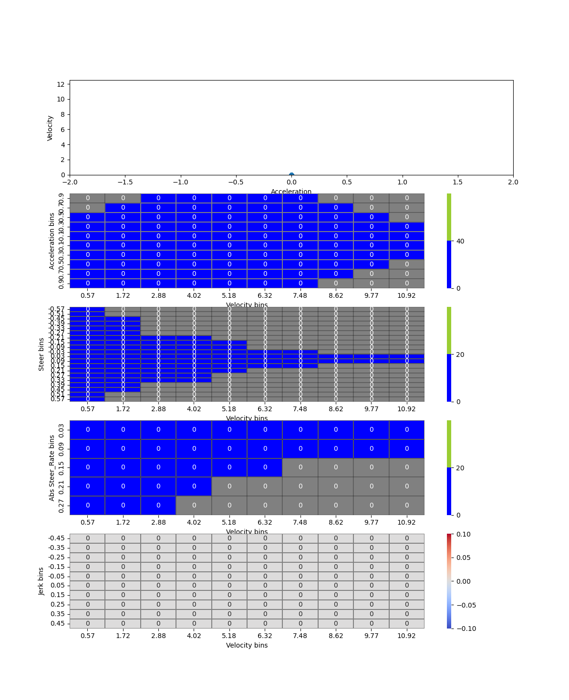

## Trajectory generation and data collection logic

- ### Data collection logic common to all courses

  In `control_data_collection_tool`, all courses collect velocity and acceleration data in a similar manner.

  By appropriately adjusting the `target_velocity` provided to the pure pursuit algorithm, speed and acceleration data are efficiently collected. Data collection consists of four phases: selection of target speed and acceleration, acceleration phase, constant speed phase, the deceleration phase. A general method for collecting speed and acceleration data is described below, though it does not strictly adhere to the outlined steps.

  1. Selection of target speed and acceleration

     In the speed-acceleration heatmap, the speed and acceleration with fewer data points are set as the target speed and acceleration, which are then defined here as `target_velocity_on_section` and `target_acceleration_on_section`.

  2. Acceleration phase
     The vehicle accelerates by setting `target_velocity` as follows until its speed exceeds `target_velocity_on_section`.

     ```Python3
       # b is constant variable and sine_curve is derived from appropriate amplitude and period, defined separately
       target_velocity = current_velocity + abs(target_acceleration_on_section) / acc_kp * (b + sine_curve)
     ```

     `current_velocity` is a current velocity of vehicle and `acc_kp` accel command proportional gain in pure pursuit algorithm. `sine_curve` is a sine wave added to partially mitigate situations where the vehicle fails to achieve the target acceleration.

  3. Constant speed phase
     When the vehicle reaches `target_velocity_on_section`, `target_velocity` is defined as follows to allow the vehicle to run around the target speed for a certain period of time.

     ```Python3
       # b is constant variable and sine_curve is derived from appropriate amplitude and period, defined separately
       target_velocity = target_velocity_on_section + b + sine_curve
     ```

  4. Deceleration phase
     In the deceleration phase, similar to the acceleration phase, `target_velocity` is defined as follows to ensure the vehicle decelerates.

     ```Python3
       # b is constant variable and sine_curve is derived from appropriate amplitude and period, defined separately
       target_velocity = current_velocity - abs(target_acceleration_on_section) / acc_kp * (b + sine_curve)
     ```

     After decelerating to a sufficiently low speed, return to step i.

- ### Trajectory generation and data collection logic specific to `reversal_loop_circle`

  In the `reversal_loop_circle` course, sections are sequentially added to the course while collecting various data on speed, acceleration, and steering angle.

- #### Trajectory generation logic for `reversal_loop_circle`

  The `reversal_loop_circle` aims to generate a trajectory with the largest possible radius of curvature within a radius `trajectory_radius`, allowing data collection in a confined area without significantly reducing speed.

  The `reversal_loop_circle` is primarily generated by connecting the following three components, `common tangent`, `circumscribing_circle` and `boundary` as shown in the following picture.

    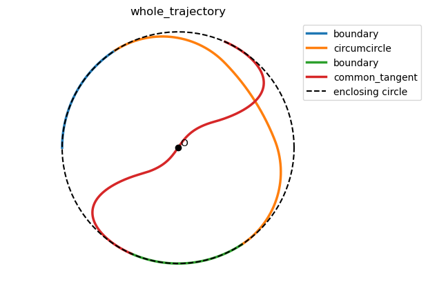

  All the components listed below are available in both clockwise and counterclockwise versions. The rationale for having two versions is to ensure data collection for both right-hand drive and left-hand drive configurations.

  - `common tangent`

    The `common tangent` is generated by drawing a common tangent to two inscribed circles. In this section, a sine curve is added in the normal direction to generate a trajectory for collecting data with larger steering angles.
    The amplitude of the sine curve is determined based on the desired steering angle data.

      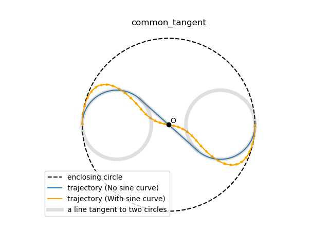

      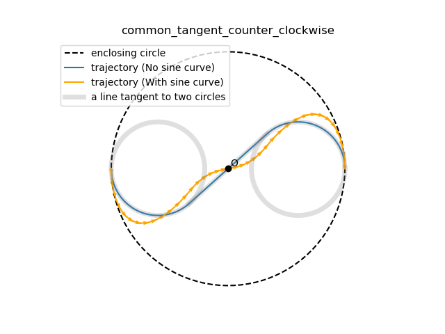

  - `circumscribing_circle`

    The `circumscribing_circle` part is created by drawing the common circumscribed circle of the circles.
    This section is generated to achieve nearly straight movement within the outer circle while minimizing the increase in curvature.

      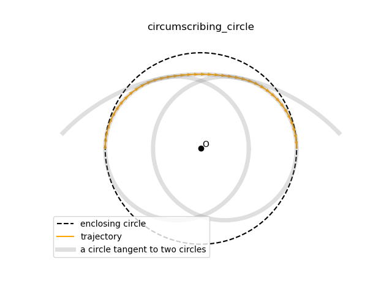

      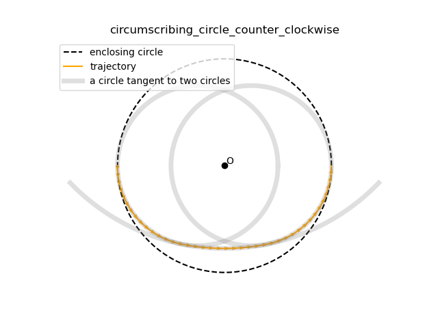

  - `boundary`

    The `boundary` part is used to connect the `common tangent` and the `circumscribing_circle` sections.

      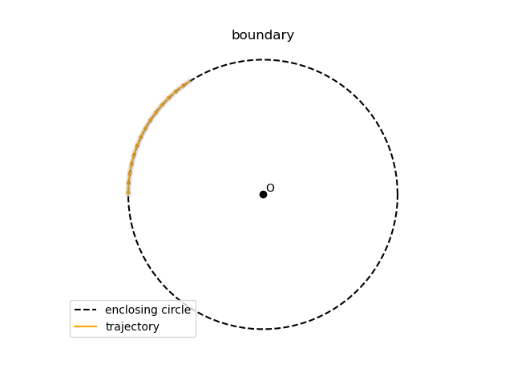

      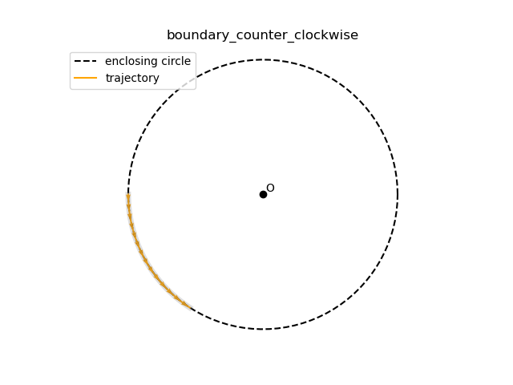

- #### Velocity and steering angle data collection logic for `reversal_loop_circle`

  Speed and steering angle data are gathered in the `common tangent` section of the trajectory. The common tangent section is particularly effective for collecting steering angle data because a trajectory with minimal data is intentionally created by adding a sine wave of suitable amplitude to the curvature.

  The following two steps are taken to obtain steering angle data.

  1. Starting from the ego vehicle's current position, the system examines a segment of the trajectory ahead, covering a distance defined by look_ahead_distance, to identify the point of maximum curvature.

  2. This maximum curvature determines the steering angle the vehicle will use. The vehicle then adjusts its speed toward the speed associated with the sparsest steering angle data.

    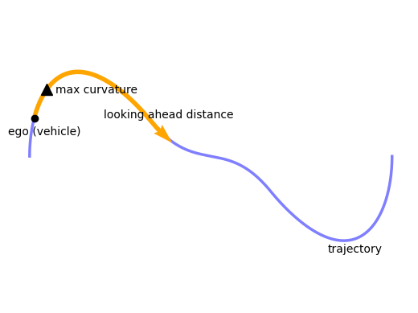

## Parameter

### Common Parameters

ROS 2 parameters which are common in all trajectories (`/config/common_param.yaml`):

| Name                                     | Type     | Description                                                                                                                               | Default value          |
| :--------------------------------------- | :------- | :---------------------------------------------------------------------------------------------------------------------------------------- | :--------------------- |
| `CONTROL_MODE`                           | `string` | Control mode [`acceleration_cmd`, `actuation_cmd`, `external_acceleration_cmd`, `external_actuation_cmd`]                                 | `acceleration_cmd`     |
| `LOAD_ROSBAG2_FILES`                     | `bool`   | Flag that determines whether to load rosbag2 data or not                                                                                  | true                   |
| `COURSE_NAME`                            | `string` | Course name [`eight_course`, `u_shaped_return`, `straight_line_positive`, `straight_line_negative`, `reversal_loop_circle`, `along_road`] | `reversal_loop_circle` |
| `NUM_BINS_V`                             | `int`    | Number of bins of velocity in heatmap                                                                                                     | 10                     |
| `NUM_BINS_STEER`                         | `int`    | Number of bins of steer in heatmap                                                                                                        | 20                     |
| `NUM_BINS_A`                             | `int`    | Number of bins of acceleration in heatmap                                                                                                 | 10                     |
| `NUM_BINS_ABS_STEER_RATE`                | `int`    | Number of bins of absolute value of steer rate in heatmap                                                                                 | 5                      |
| `NUM_BINS_JERK`                          | `int`    | Number of bins of jerk in heatmap                                                                                                         | 10                     |
| `NUM_BINS_ACCEL_PEDAL_INPUT`             | `int`    | Number of bins of accel pedal input in heatmap                                                                                            | 8                      |
| `NUM_BINS_BRAKE_PEDAL_INPUT`             | `int`    | Number of bins of brake pedal input in heatmap                                                                                            | 16                     |
| `V_MIN`                                  | `double` | Minimum velocity in heatmap [m/s]                                                                                                         | 0.0                    |
| `V_MAX`                                  | `double` | Maximum velocity in heatmap [m/s]                                                                                                         | 11.5                   |
| `STEER_MIN`                              | `double` | Minimum steer in heatmap [rad]                                                                                                            | -0.6                   |
| `STEER_MAX`                              | `double` | Maximum steer in heatmap [rad]                                                                                                            | 0.6                    |
| `A_MIN`                                  | `double` | Minimum acceleration in heatmap [m/s^2]                                                                                                   | -1.0                   |
| `A_MAX`                                  | `double` | Maximum acceleration in heatmap [m/s^2]                                                                                                   | 1.0                    |
| `max_lateral_accel`                      | `double` | Max lateral acceleration limit [m/s^2]                                                                                                    | 2.70                   |
| `ABS_STEER_RATE_MIN`                     | `double` | Minimum absolute value of steer rate in heatmap [rad/s]                                                                                   | 0.0                    |
| `ABS_STEER_RATE_MAX`                     | `double` | Maximum absolute value of steer rate in heatmap [rad/s]                                                                                   | 0.3                    |
| `JERK_MIN`                               | `double` | Minimum jerk in heatmap [m/s^3]                                                                                                           | -0.5                   |
| `JERK_MAX`                               | `double` | Maximum jerk in heatmap [m/s^3]                                                                                                           | 0.5                    |
| `ACCEL_PEDAL_INPUT_MIN`                  | `double` | Minimum accel pedal in heatmap                                                                                                            | 0.4                    |
| `ACCEL_PEDAL_INPUT_MAX`                  | `double` | Maximum accel pedal in heatmap                                                                                                            | 0.0                    |
| `BRAKE_PEDAL_INPUT_MIN`                  | `double` | Minimum brake pedal in heatmap                                                                                                            | 0.8                    |
| `BRAKE_PEDAL_INPUT_MAX`                  | `double` | Maximum brake pedal in heatmap                                                                                                            | 0.0                    |
| `STEER_THRESHOLD_FOR_PEDAL_INPUT_COUNT`  | `string` | Threshold of steering angle to count pedal input data                                                                                     | 0.2                    |
| `MASK_NAME`                              | `string` | Directory name of masks for data collection                                                                                               | `default`              |
| `VEL_ACC_THRESHOLD`                      | `int`    | Threshold of velocity-and-acc heatmap in data collection                                                                                  | 40                     |
| `VEL_STEER_THRESHOLD`                    | `int`    | Threshold of velocity-and-steer heatmap in data collection                                                                                | 20                     |
| `VEL_ABS_STEER_RATE_THRESHOLD`           | `int`    | Threshold of velocity-and-abs_steer_rate heatmap in data collection                                                                       | 20                     |
| `max_lateral_accel`                      | `double` | Max lateral acceleration limit [m/s^2]                                                                                                    | 2.00                   |
| `lateral_error_threshold`                | `double` | Lateral error threshold where applying velocity limit [m]                                                                                 | 1.50                   |
| `yaw_error_threshold`                    | `double` | Yaw error threshold where applying velocity limit [rad]                                                                                   | 0.75                   |
| `velocity_limit_by_tracking_error`       | `double` | Velocity limit applied when tracking error exceeds threshold [m/s]                                                                        | 1.0                    |
| `mov_ave_window`                         | `int`    | Moving average smoothing window size                                                                                                      | 50                     |
| `target_longitudinal_velocity`           | `double` | Target longitudinal velocity [m/s]                                                                                                        | 6.0                    |
| `pure_pursuit_type`                      | `string` | Pure pursuit type (`naive` or `linearized` steer control law )                                                                            | `linearized`           |
| `wheel_base`                             | `double` | Wheel base [m]                                                                                                                            | 2.79                   |
| `acc_kp`                                 | `double` | Accel command proportional gain                                                                                                           | 1.0                    |
| `lookahead_time`                         | `double` | Pure pursuit lookahead time [s]                                                                                                           | 2.0                    |
| `min_lookahead`                          | `double` | Pure pursuit minimum lookahead length [m]                                                                                                 | 2.0                    |
| `linearized_pure_pursuit_steer_kp_param` | `double` | Linearized pure pursuit steering P gain parameter                                                                                         | 2.0                    |
| `linearized_pure_pursuit_steer_kd_param` | `double` | Linearized pure pursuit steering D gain parameter                                                                                         | 2.0                    |
| `stop_acc`                               | `double` | Accel command for stopping data collecting driving [m/s^2]                                                                                | -2.0                   |
| `stop_jerk_lim`                          | `double` | Jerk limit for stopping data collecting driving [m/s^3]                                                                                   | 5.0                    |
| `lon_acc_lim`                            | `double` | Longitudinal acceleration limit [m/s^2]                                                                                                   | 1.5                    |
| `lon_jerk_lim`                           | `double` | Longitudinal jerk limit [m/s^3]                                                                                                           | 0.5                    |
| `steer_lim`                              | `double` | Steering angle limit [rad]                                                                                                                | 0.6                    |
| `steer_rate_lim`                         | `double` | Steering angle rate limit [rad/s]                                                                                                         | 0.6                    |

The following parameters are common to all trajectories but can be defined individually for each trajectory. (`/config/course_param/COURSE_NAME_param.yaml`):

| Name                                     | Type     | Description                                                           | Default value |
| :--------------------------------------- | :------- | :-------------------------------------------------------------------- | :------------ |
| `COLLECTING_DATA_V_MIN`                  | `double` | Minimum velocity for data collection [m/s]                            | 0.5           |
| `COLLECTING_DATA_V_MAX`                  | `double` | Maximum velocity for data collection [m/s]                            | 8.0           |
| `COLLECTING_DATA_A_MIN`                  | `double` | Minimum velocity for data collection [m/s^2]                          | 1.0           |
| `COLLECTING_DATA_A_MAX`                  | `double` | Maximum velocity for data collection [m/s^2]                          | -1.0          |
| `longitudinal_velocity_noise_amp`        | `double` | Target longitudinal velocity additional sine noise amplitude [m/s]    | 0.01          |
| `longitudinal_velocity_noise_min_period` | `double` | Target longitudinal velocity additional sine noise minimum period [s] | 5.0           |
| `longitudinal_velocity_noise_max_period` | `double` | Target longitudinal velocity additional sine noise maximum period [s] | 20.0          |
| `acc_noise_amp`                          | `double` | Accel command additional sine noise amplitude [m/ss]                  | 0.01          |
| `acc_noise_min_period`                   | `double` | Accel command additional sine noise minimum period [s]                | 5.0           |
| `acc_noise_max_period`                   | `double` | Accel command additional sine noise maximum period [s]                | 20.0          |
| `steer_noise_amp`                        | `double` | Steer command additional sine noise amplitude [rad]                   | 0.01          |
| `steer_noise_max_period`                 | `double` | Steer command additional sine noise maximum period [s]                | 5.0           |
| `steer_noise_min_period`                 | `double` | Steer command additional sine noise minimum period [s]                | 20.0          |

### Course-Specific Parameters

Each trajectory has specific ROS 2 parameters.

- `COURSE_NAME: eight_course`

| Name                | Type     | Description                                  | Default value |
| :------------------ | :------- | :------------------------------------------- | :------------ |
| `velocity_on_curve` | `double` | Constant velocity on curve [m/s]             | 4.5           |
| `smoothing_window`  | `double` | Width of the window for trajectory smoothing | 400           |

- `COURSE_NAME: u_shaped_return`

| Name                | Type     | Description                      | Default value |
| :------------------ | :------- | :------------------------------- | :------------ |
| `velocity_on_curve` | `double` | Constant velocity on curve [m/s] | 4.5           |

- `COURSE_NAME: straight_line_positive` or `COURSE_NAME: straight_line_negative`

| Name                       | Type     | Description                                           | Default value |
| :------------------------- | :------- | :---------------------------------------------------- | :------------ |
| `stopping_buffer_distance` | `double` | The safety distance from end of the straight line [m] | 10.0          |

- `COURSE_NAME: reversal_loop_circle`

| Name                  | Type     | Description                                                                         | Default value |
| :-------------------- | :------- | :---------------------------------------------------------------------------------- | :------------ |
| `trajectory_radius`   | `double` | Radius of the circle where trajectories are generated [m]                           | 35.0          |
| `enclosing_radius`    | `double` | Radius of the circle enclosing the generated trajectories [m]                       | 40.0          |
| `look_ahead_distance` | `double` | The distance referenced ahead of the vehicle for collecting steering angle data [m] | 35.0          |

- `COURSE_NAME: along_road`

| Name                              | Type     | Description                                                         | Default value |
| :-------------------------------- | :------- | :------------------------------------------------------------------ | :------------ |
| `velocity_on_curve`               | `double` | Constant velocity on curve [m/s]                                    | 3.5           |
| `stopping_buffer_distance`        | `double` | The safety distance from end of the straight line [m]               | 15.0          |
| `course_width`                    | `double` | The width of the trajectory [m]                                     | 1.5           |
| `smoothing_window`                | `double` | Width of the window for trajectory smoothing                        | 100           |
| `minimum_length_of_straight_line` | `double` | The minimum length of straight line for data collection [m]         | 50.0          |
| `longitude`                       | `double` | The longitude of the origin specified when loading the map [degree] | 139.6503      |
| `latitude`                        | `double` | The latitude of the origin specified when loading the map [degree]  | 35.6762       |

### Parameters for `data_collecting_acceleration_cmd.py` and `data_collecting_actuation_cmd.py`

- `data_collecting_acceleration_cmd.py`

| Name                            | Type     | Description                                                                 | Default value |
| :------------------------------ | :------- | :-------------------------------------------------------------------------- | :------------ |
| `TARGET_VELOCITY`               | `double` | The maximum velocity for data collection [m/s]                              | 11.80         |
| `TARGET_ACCELERATION_FOR_DRIVE` | `double` | Target acceleration when collecting deceleration data [m/s^2]               | 0.3           |
| `TARGET_ACCELERATION_FOR_BRAKE` | `double` | Target deceleration when collecting acceleration data [m/s^2]               | 0.5           |
| `TARGET_JERK_FOR_DRIVE`         | `double` | The target rate of change of acceleration (jerk) for smooth driving [m/s^3] | 1.5           |
| `TARGET_JERK_FOR_BRAKE`         | `double` | The target rate of change of acceleration (jerk) when braking [m/s^3]       | -1.5          |
| `MIN_ACCEL`                     | `double` | The minimum allowable acceleration for data collection [m/s^2]              | -5.0          |
| `MAX_ACCEL`                     | `double` | The maximum allowable acceleration for data collection [m/s^2]              | 2.0           |

- `data_collecting_actuation_cmd.py`

| Name                         | Type     | Description                                                     | Default value |
| :--------------------------- | :------- | :-------------------------------------------------------------- | :------------ |
| `TARGET_VELOCITY`            | `double` | The maximum velocity for data collection [m/s]                  | 11.80         |
| `TARGET_ACTUATION_FOR_ACCEL` | `double` | Target accel pedal input when collecting brake pedal input data | 0.3           |
| `TARGET_ACTUATION_FOR_BRAKE` | `double` | Target brake pedal input when collecting accel pedal input data | 0.5           |
| `MAX_ACCEL_PEDAL`            | `double` | The maximum allowable accel pedal input for data collection     | 0.5           |
| `MIN_BRAKE_PEDAL`            | `double` | The maximum allowable brake pedal input for data collection     | 0.8           |
