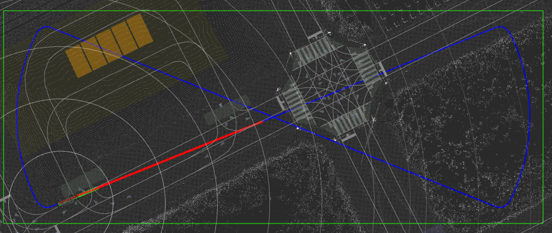
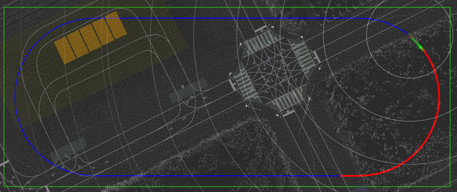
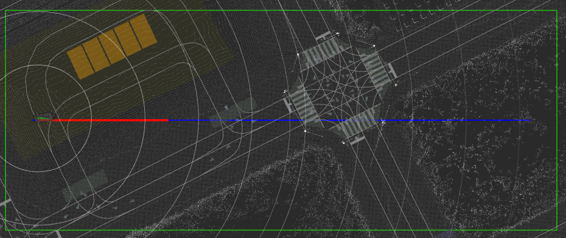
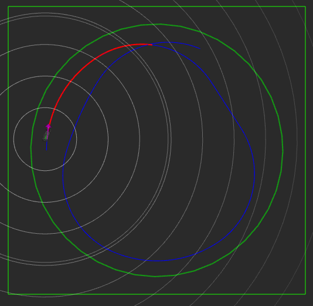
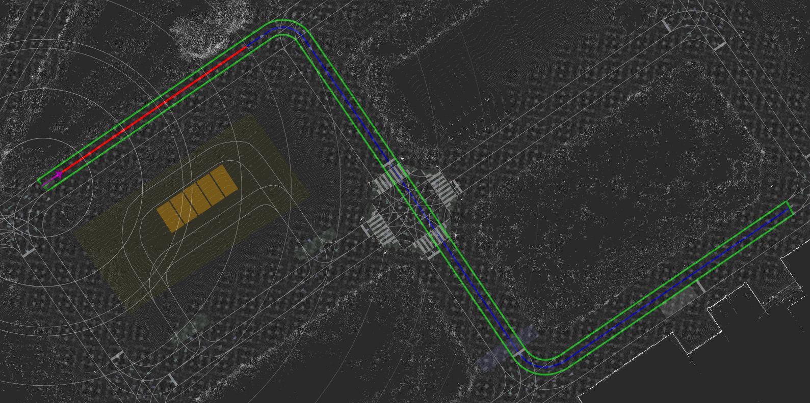
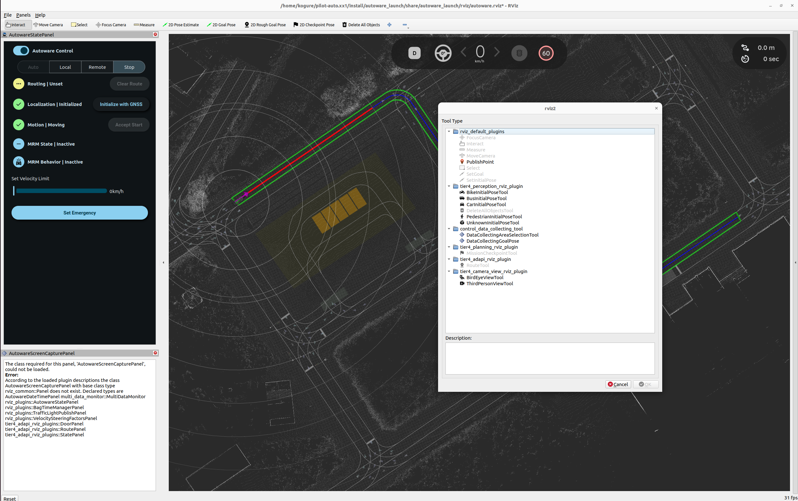
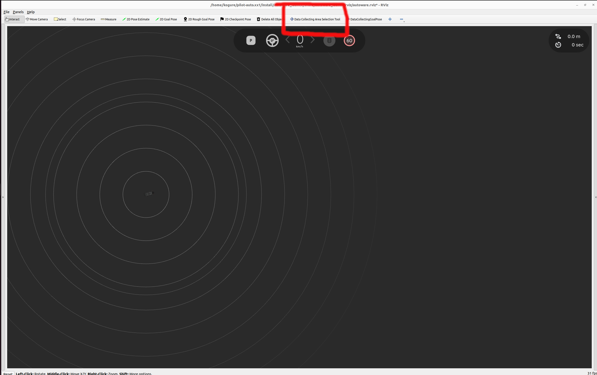
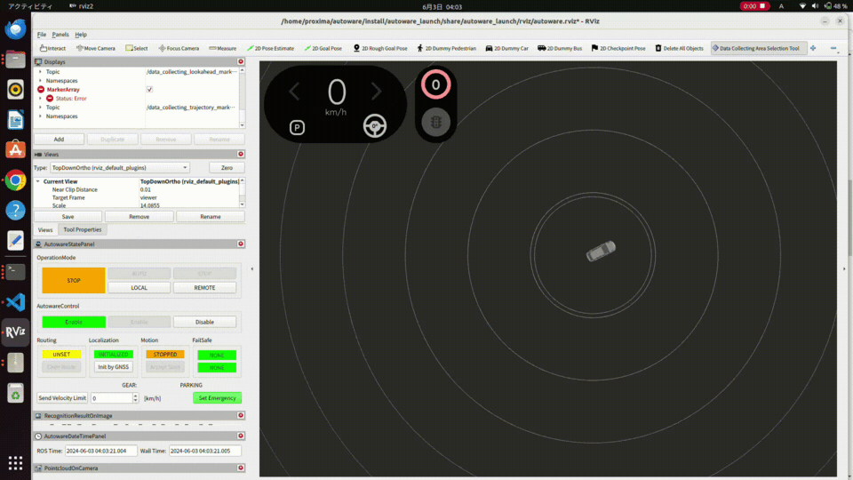
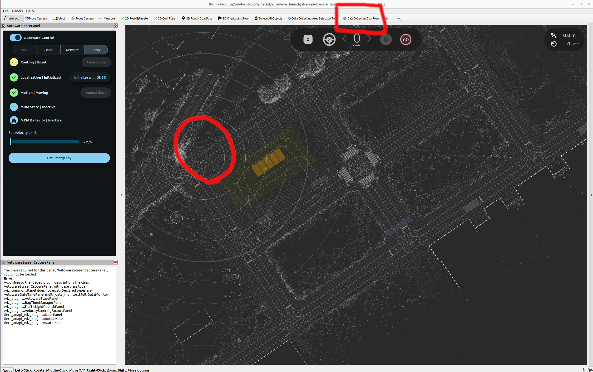

# Control data collecting tool

This package provides tools for automatically collecting data using pure pursuit control within a specified rectangular area.


## Overview

- This package aims to collect a dataset consisting of control inputs (i.e. `control_cmd`) and observation variables (i.e. `kinematic_state`, `steering_status`, etc).
- The collected dataset can be used as training dataset for learning-based controllers, including [smart_mpc](https://github.com/autowarefoundation/autoware.universe/tree/f30c0350861d020ad26a45806ab1334895122fab/control/smart_mpc_trajectory_follower).
- The data collecting approach is as follows:

  - Following the trajectory using a pure pursuit control law.
  - Adding noises to the trajectory and the control command for data diversity, improving the prediction accuracy of learning model.
  - Setting the trajectory from the following types of trajectories ( [`eight_course`, `u_shaped_return`, `straight_line_positive`, `straight_line_negative`, `reversal_loop_circle`, `along_road`] ).

    - `COURSE_NAME: eight_course`

      

    - `COURSE_NAME: u_shaped_return`

      

    - `COURSE_NAME: straight_line_positive` or `COURSE_NAME: straight_line_negative`
      ( Both "straight_line_positive" and "straight_line_negative" represent straight line courses, but the direction of travel of the course is reversed.)

      

    - `COURSE_NAME: reversal_loop_circle`

      

    - `COURSE_NAME: along_road`

      

## How to use

1. Launch Autoware.

   ```bash
   ros2 launch autoware_launch planning_simulator.launch.xml map_path:=$HOME/autoware_map/sample-map-planning vehicle_model:=sample_vehicle sensor_model:=sample_sensor_kit
   ```

2. Set an initial pose, see [here](https://autowarefoundation.github.io/autoware-documentation/main/tutorials/ad-hoc-simulation/planning-simulation/#2-set-an-initial-pose-for-the-ego-vehicle).

3. Add the DataCollectingAreaSelectionTool and DataCollectingGoalPlugin RViz plugins by clicking the "+" icon at the top of the RViz window.

   

4. Launch control_data_collecting_tool.

   ```bash
   ros2 launch control_data_collecting_tool control_data_collecting_tool.launch.py map_path:=:=$HOME/autoware_map/sample-map-planning
   ```

   - Control data collecting tool automatically records topics included in `config/topics.yaml` when the above command is executed.
     The topics will be saved in rosbag2 format in the directory where the above command is executed.

   - The data from `/localization/kinematic_state` and `/localization/acceleration` located in the directory (rosbag2 format) where the command is executed will be automatically loaded and reflected in the data count for these topics.
     (If `LOAD_ROSBAG2_FILES` in `config/param.yaml` is set to `false`, the data is noe loaded.)

5. Add visualization in rviz:

   - `/data_collecting_area`
     - Type: Polygon
   - `/data_collecting_trajectory_marker_array`
     - Type: MarkerArray
   - `/data_collecting_lookahead_marker_array`
     - Type: MarkerArray

6. The following actions differ depending on the selected course. If you select the trajectory from [`eight_course`, `u_shaped_return`, `straight_line_positive`, `straight_line_negative`, `reversal_loop_circle`], proceed to 6-1. If you select the trajectory from [`along_road`].

- 6-1. If you choose the trajectory from [`eight_course`, `u_shaped_return`, `straight_line_positive`, `straight_line_negative`, `reversal_loop_circle`], select `DataCollectingAreaSelectionTool` plugin.

   

  Highlight the data collecting area by dragging the mouse over it.

   

  > [!NOTE]
  > You cannot change the data collecting area while driving.

- 6-2. If you choose the trajectory from [`along_road`], put your vehicle on the map and select `DataCollectingGoalPose` plugin.

   

  By setting the pose of the goal point, a trajectory is generated on the map.

   

  > [!NOTE]
  > You cannot change the goal pose while driving.

  > [!NOTE]
  > In cases where course generation fails, which can happen under certain conditions, please reposition the vehicle or redraw the goal pose.

7. Click the `LOCAL` button on `OperationMode` in `AutowareStatePanel`.

   

   Then, data collecting starts.

   

8. If you want to stop data collecting automatic driving, run the following command

   ```bash
   ros2 topic pub /data_collecting_stop_request std_msgs/msg/Bool "data: true" --once
   ```

   > [!NOTE]
   > When the car crosses the green boundary line, a similar stopping procedure will be automatically triggered.

9. If you want to restart data collecting automatic driving, run the following command

   ```bash
   ros2 topic pub /data_collecting_stop_request std_msgs/msg/Bool "data: false" --once
   ```

## Parameter

There are parameters that are common to all trajectories and parameters that are specific to each trajectory.

### Common Parameters

ROS 2 params which are common in all trajectories (`/config/common_param.yaml`):

| Name                                     | Type     | Description                                                                                                                               | Default value  |
| :--------------------------------------- | :------- | :---------------------------------------------------------------------------------------------------------------------------------------- | :------------- |
| `LOAD_ROSBAG2_FILES`                     | `bool`   | Flag that determines whether to load rosbag2 data or not                                                                                  | True           |
| `COURSE_NAME`                            | `string` | Course name [`eight_course`, `u_shaped_return`, `straight_line_positive`, `straight_line_negative`, `reversal_loop_circle`, `along_road`] | `eight_course` |
| `NUM_BINS_V`                             | `int`    | Number of bins of velocity in heatmap                                                                                                     | 10             |
| `NUM_BINS_STEER`                         | `int`    | Number of bins of steer in heatmap                                                                                                        | 10             |
| `NUM_BINS_A`                             | `int`    | Number of bins of acceleration in heatmap                                                                                                 | 10             |
| `V_MIN`                                  | `double` | Minimum velocity in heatmap [m/s]                                                                                                         | 0.0            |
| `V_MAX`                                  | `double` | Maximum velocity in heatmap [m/s]                                                                                                         | 11.5           |
| `STEER_MIN`                              | `double` | Minimum steer in heatmap [rad]                                                                                                            | -1.0           |
| `STEER_MAX`                              | `double` | Maximum steer in heatmap [rad]                                                                                                            | 1.0            |
| `A_MIN`                                  | `double` | Minimum acceleration in heatmap [m/ss]                                                                                                    | -1.0           |
| `A_MAX`                                  | `double` | Maximum acceleration in heatmap [m/ss]                                                                                                    | 1.0            |
| `max_lateral_accel`                      | `double` | Max lateral acceleration limit [m/ss]                                                                                                     | 0.5            |
| `lateral_error_threshold`                | `double` | Lateral error threshold where applying velocity limit [m/s]                                                                               | 5.0            |
| `yaw_error_threshold`                    | `double` | Yaw error threshold where applying velocity limit [rad]                                                                                   | 0.50           |
| `velocity_limit_by_tracking_error`       | `double` | Velocity limit applied when tracking error exceeds threshold [m/s]                                                                        | 1.0            |
| `mov_ave_window`                         | `int`    | Moving average smoothing window size                                                                                                      | 100            |
| `target_longitudinal_velocity`           | `double` | Target longitudinal velocity [m/s]                                                                                                        | 6.0            |
| `pure_pursuit_type`                      | `string` | Pure pursuit type (`naive` or `linearized` steer control law )                                                                            | `linearized`   |
| `wheel_base`                             | `double` | Wheel base [m]                                                                                                                            | 2.79           |
| `acc_kp`                                 | `double` | Accel command proportional gain                                                                                                           | 1.0            |
| `lookahead_time`                         | `double` | Pure pursuit lookahead time [s]                                                                                                           | 2.0            |
| `min_lookahead`                          | `double` | Pure pursuit minimum lookahead length [m]                                                                                                 | 2.0            |
| `linearized_pure_pursuit_steer_kp_param` | `double` | Linearized pure pursuit steering P gain parameter                                                                                         | 2.0            |
| `linearized_pure_pursuit_steer_kd_param` | `double` | Linearized pure pursuit steering D gain parameter                                                                                         | 2.0            |
| `stop_acc`                               | `double` | Accel command for stopping data collecting driving [m/ss]                                                                                 | -2.0           |
| `stop_jerk_lim`                          | `double` | Jerk limit for stopping data collecting driving [m/sss]                                                                                   | 5.0            |
| `lon_acc_lim`                            | `double` | Longitudinal acceleration limit [m/ss]                                                                                                    | 5.0            |
| `lon_jerk_lim`                           | `double` | Longitudinal jerk limit [m/sss]                                                                                                           | 5.0            |
| `steer_lim`                              | `double` | Steering angle limit [rad]                                                                                                                | 1.0            |
| `steer_rate_lim`                         | `double` | Steering angle rate limit [rad/s]                                                                                                         | 1.0            |

The following parameters are common to all trajectories but can be defined individually for each trajectory. (`/config/course_param/COURSE_NAME_param.yaml`):
| Name | Type | Description | Default value |
| :--------------------------------------- | :------- | :-------------------------------------------------------------------------------------------------- | :------------- |
| `COLLECTING_DATA_V_MIN` | `double` | Minimum velocity for data collection [m/s] | 0.0 |
| `COLLECTING_DATA_V_MAX` | `double` | Maximum velocity for data collection [m/s] | 8.0 |
| `COLLECTING_DATA_A_MIN` | `double` | Minimum velocity for data collection [m/ss] | 1.0 |
| `COLLECTING_DATA_A_MAX` | `double` | Maximum velocity for data collection [m/ss] | -1.0 |
| `longitudinal_velocity_noise_amp` | `double` | Target longitudinal velocity additional sine noise amplitude [m/s] | 0.01 |
| `longitudinal_velocity_noise_min_period` | `double` | Target longitudinal velocity additional sine noise minimum period [s] | 5.0 |
| `longitudinal_velocity_noise_max_period` | `double` | Target longitudinal velocity additional sine noise maximum period [s] | 20.0 |
| `acc_noise_amp` | `double` | Accel command additional sine noise amplitude [m/ss] | 0.01 |
| `acc_noise_min_period` | `double` | Accel command additional sine noise minimum period [s] | 5.0 |
| `acc_noise_max_period` | `double` | Accel command additional sine noise maximum period [s] | 20.0 |
| `steer_noise_amp` | `double` | Steer command additional sine noise amplitude [rad] | 0.01 |
| `steer_noise_max_period` | `double` | Steer command additional sine noise maximum period [s] | 5.0 |
| `steer_noise_min_period` | `double` | Steer command additional sine noise minimum period [s] | 20.0 |

### Course-Specific Parameters

- `COURSE_NAME: eight_course`

| Name                | Type     | Description                              | Default value |
| :------------------ | :------- | :--------------------------------------- | :------------ |
| `velocity_on_curve` | `double` | Constant velocity on curve [m/s]         | 4.5           |
| `smoothing_window`  | `double` | Width of window for smoothing trajectory | 400           |

- `COURSE_NAME: u_shaped_return`

| Name                | Type     | Description                      | Default value |
| :------------------ | :------- | :------------------------------- | :------------ |
| `velocity_on_curve` | `double` | Constant velocity on curve [m/s] | 4.5           |

- `COURSE_NAME: straight_line_positive` or `COURSE_NAME: straight_line_negative`

| Name                       | Type     | Description                                           | Default value |
| :------------------------- | :------- | :---------------------------------------------------- | :------------ |
| `stopping_buffer_distance` | `double` | The safety distance from end of the straihgh line [m] | 10.0          |

- `COURSE_NAME: reversal_loop_circle`

| Name     | Type     | Description                                               | Default value |
| :------- | :------- | :-------------------------------------------------------- | :------------ |
| `Radius` | `double` | Radius of the circle where trajectories are generated [m] | 35.0          |

- `COURSE_NAME: along_road`

| Name                       | Type     | Description                                           | Default value |
| :------------------------- | :------- | :---------------------------------------------------- | :------------ |
| `velocity_on_curve`        | `double` | Constant velocity on curve [m/s]                      | 3.5           |
| `stopping_buffer_distance` | `double` | The safety distance from end of the straight line [m] | 15.0          |
| `course_width`             | `double` | The width of the trajectory [m]                       | 1.5           |
