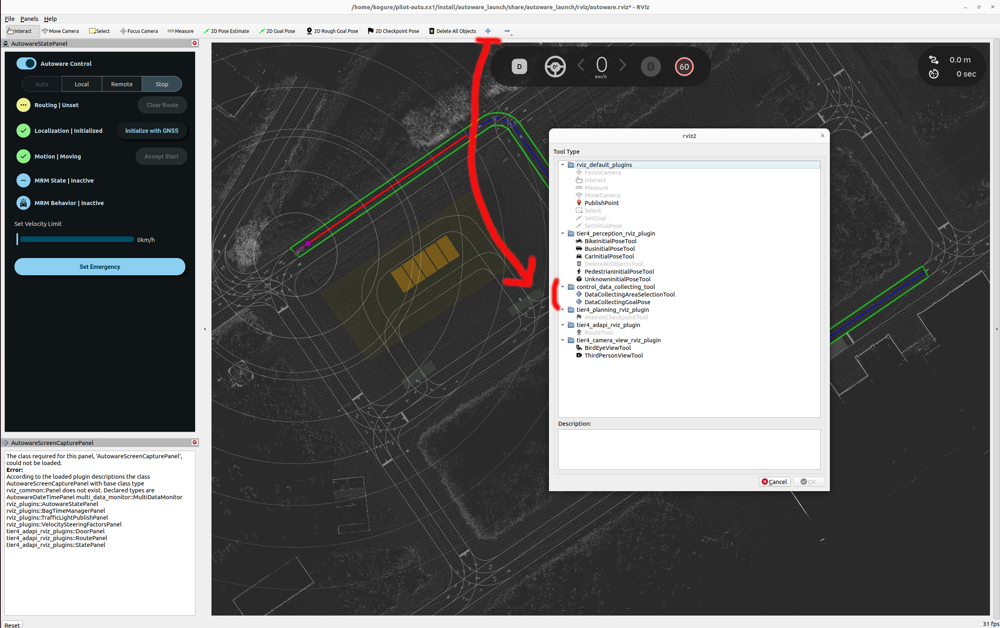

# Control data collecting tool

This package provides tools for automatically collecting data using pure pursuit control within a specified rectangular area.


## Overview

- This package aims to collect a dataset consisting of control inputs (i.e. `control_cmd`) and observation variables (i.e. `kinematic_state`, `steering_status`, etc).
- The collected dataset can be used as training dataset for learning-based controllers, including [smart_mpc](https://github.com/autowarefoundation/autoware.universe/tree/main/control/smart_mpc_trajectory_follower).
- The data collecting approach is as follows:
  - Seting a figure-eight target trajectory within the specified rectangular area.
  - Following the trajectory using a pure pursuit control law.
  - Adding noises to the trajectory and the control command for data diversity, improveing the prediction accuracy of learning model.

## How to use

1. Launch Autoware.

   ```bash
   ros2 launch autoware_launch planning_simulator.launch.xml map_path:=$HOME/autoware_map/sample-map-planning vehicle_model:=sample_vehicle sensor_model:=sample_sensor_kit
   ```

2. Set an initial pose, see [here](https://autowarefoundation.github.io/autoware-documentation/main/tutorials/ad-hoc-simulation/planning-simulation/#2-set-an-initial-pose-for-the-ego-vehicle).

3. Add `DataCollectingAreaSelectionTool` rviz plugin.

   

4. Launch control_data_collecting_tool.

   ```bash
   ros2 launch control_data_collecting_tool control_data_collecting_tool.launch.py
   ```

5. Add visualization in rviz:

   - `/data_collecting_area`
     - Type: Polygon
   - `/data_collecting_trajectory_marker_array`
     - Type: MarkerArray
   - `/data_collecting_lookahead_marker_array`
     - Type: MarkerArray

6. Select `DataCollectingAreaSelectionTool` plugin.

   

   Highlight the data collecting area by dragging the mouse over it.

   

   > [!NOTE]
   > You cannot change the data collecting area while driving.

7. start recording rosbag data. For example, run the following command:

   ```bash
   ros2 bag record /localization/kinematic_state /localization/acceleration /vehicle/status/steering_status /sensing/imu/imu_data /system/operation_mode/state /vehicle/status/control_mode /external/selected/control_cmd /external/selected/gear_cmd /data_collecting_trajectory
   ```

8. Click the `LOCAL` button on `OperationMode` in `AutowareStatePanel`.

   

   Then, data collecting starts.

   

9. If you want to stop data collecting automatic driving, run the following command

   ```bash
   ros2 topic pub /data_collecting_stop_request std_msgs/msg/Bool "data: true" --once
   ```

10. If you want to restart data collecting automatic driving, run the following command

```bash
ros2 topic pub /data_collecting_stop_request std_msgs/msg/Bool "data: false" --once
```

## Parameter

ROS 2 params in `/data_collecting_trajectory_publisher` node:

| Name                                     | Type     | Description                                                           | Default value |
| :--------------------------------------- | :------- | :-------------------------------------------------------------------- | :------------ |
| `max_lateral_accel`                      | `double` | Max lateral acceleration limit [m/ss]                                 | 2.94          |
| `lateral_error_threshold`                | `double` | Lateral error threshold where applying velocity limit [m/s]           | 5.0           |
| `yaw_error_threshold`                    | `double` | Yaw error threshold where applying velocity limit [rad]               | 0.5           |
| `velocity_limit_by_tracking_error`       | `double` | Velocity limit applied when tracking error exceeds threshold [m/s]    | 2.0           |
| `mov_ave_window`                         | `int`    | Moving average smoothing window size                                  | 50            |
| `target_longitudinal_velocity`           | `double` | Target longitudinal velocity [m/s]                                    | 6.0           |
| `longitudinal_velocity_noise_amp`        | `double` | Target longitudinal velocity additional sine noise amplitude [m/s]    | 0.1           |
| `longitudinal_velocity_noise_min_period` | `double` | Target longitudinal velocity additional sine noise minimum period [s] | 5.0           |
| `longitudinal_velocity_noise_max_period` | `double` | Target longitudinal velocity additional sine noise maximum period [s] | 20.0          |

ROS 2 params in `/data_collecting_pure_pursuit_trajectory_follower` node:

| Name                                     | Type     | Description                                                    | Default value |
| :--------------------------------------- | :------- | :------------------------------------------------------------- | :------------ |
| `pure_pursuit_type`                      | `string` | Pure pursuit type (`naive` or `linearized` steer control law ) | `linearized`  |
| `wheel_base`                             | `double` | Wheel base [m]                                                 | 2.79          |
| `acc_kp`                                 | `double` | Accel command propotional gain                                 | 0.5           |
| `lookahead_time`                         | `double` | Pure pursuit lookahead time [s]                                | 1.5           |
| `min_lookahead`                          | `double` | Pure pursuit minimum lookahead length [m]                      | 3.0           |
| `linearized_pure_pursuit_steer_kp_param` | `double` | Linearized pure pursuit steering P gain parameter              | 2.0           |
| `linearized_pure_pursuit_steer_kd_param` | `double` | Linearized pure pursuit steering D gain parameter              | 2.0           |
| `stop_acc`                               | `double` | Accel command for stopping data collecting driving [m/ss]      | -2.0          |
| `stop_jerk_lim`                          | `double` | Jerk limit for stopping data collecting driving [m/sss]        | 1.0           |
| `steer_limit`                            | `double` | Steer control input limit [rad]                                | 0.5           |
| `acc_noise_amp`                          | `double` | Accel command additional sine noise amplitude [m/ss]           | 0.01          |
| `acc_noise_min_period`                   | `double` | Accel command additional sine noise minimum period [s]         | 5.0           |
| `acc_noise_max_period`                   | `double` | Accel command additional sine noise maximum period [s]         | 20.0          |
| `steer_noise_amp`                        | `double` | Steer command additional sine noise amplitude [rad]            | 0.01          |
| `steer_noise_max_period`                 | `double` | Steer command additional sine noise maximum period [s]         | 5.0           |
| `steer_noise_min_period`                 | `double` | Steer command additional sine noise minimum period [s]         | 20.0          |
