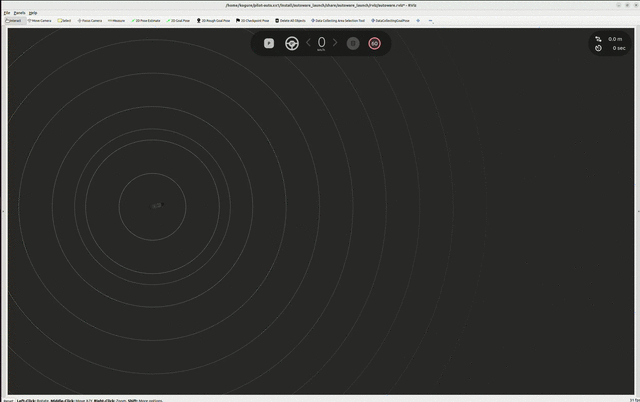
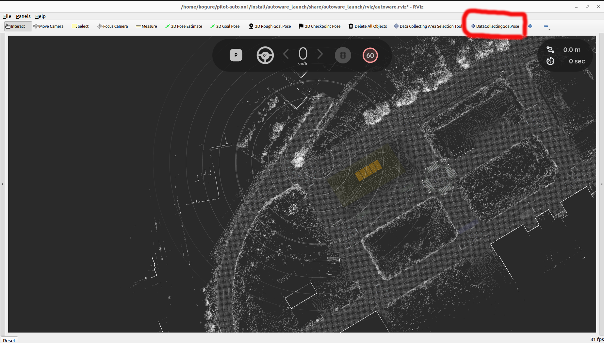
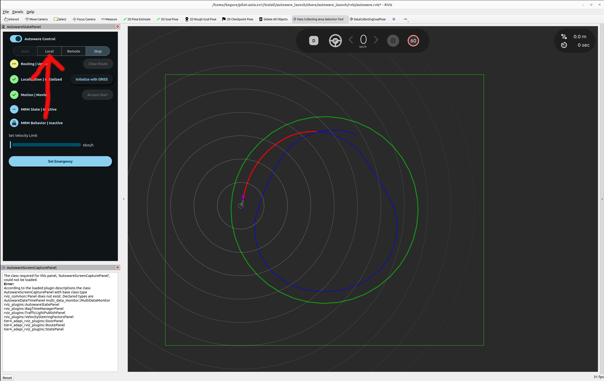

# Control data collecting tool

This package provides tools for automatically collecting data using pure pursuit control within a specified rectangular area.


## Overview

- This package aims to collect a dataset consisting of control inputs (i.e. `control_cmd`) and observation variables (i.e. `kinematic_state`, `steering_status`, etc).
- The collected dataset can be used as training dataset for learning-based controllers, including [smart_mpc](https://github.com/autowarefoundation/autoware.universe/tree/f30c0350861d020ad26a45806ab1334895122fab/control/smart_mpc_trajectory_follower).
- Data collecting approach is as follows:

  - Following the trajectory using a pure pursuit control law.
  - Adding noises to the trajectory and the control command for data diversity, improving the prediction accuracy of learning model.
  - Setting the trajectory from the following types of trajectories ( [`eight_course`, `u_shaped_return`, `straight_line_positive`, `straight_line_negative`, `reversal_loop_circle`, `along_road`] ).

    - `COURSE_NAME: eight_course`

      

    - `COURSE_NAME: u_shaped_return`

      

    - `COURSE_NAME: straight_line_positive` or `COURSE_NAME: straight_line_negative`

      ( Both "straight_line_positive" and "straight_line_negative" represent straight line courses, but the direction of travel of the course is reversed.)

      

    - `COURSE_NAME: reversal_loop_circle`

      Drive within a circle while adding trajectories and collect data.

      

    - `COURSE_NAME: along_road`

      Generate trajectories along the road. This is particularly useful when drawing long straight paths along the road.

      In this course, data collection is conducted only on long straight trajectories, while constant velocity, `velocity_on_curve`, is maintained when driving on sections that include curves.

      The minimum length of these long straight trajectories can be specified using the parameter `minimum_length_of_straight_line` (These two parameters `velocity_on_curve` and `minimum_length_of_straight_line` can be configured in `./config/course_param/along_road_param.yaml`).

      

## How to Use

<!-- prettier-ignore-start -->
<!-- Since markdownlint and prettier formats are different, use only markdownlint. -->

1. Launch Autoware.

    ```bash
    ros2 launch autoware_launch planning_simulator.launch.xml map_path:=$HOME/autoware_map/sample-map-planning vehicle_model:=sample_vehicle sensor_model:=sample_sensor_kit
    ```

2. Set an initial pose, see [here](https://autowarefoundation.github.io/autoware-documentation/main/tutorials/ad-hoc-simulation/planning-simulation/#2-set-an-initial-pose-for-the-ego-vehicle).

3. Add the DataCollectingAreaSelectionTool and DataCollectingGoalPlugin RViz plugins by clicking the "+" icon at the top of the RViz window. <br> 

4. Launch control_data_collecting_tool.

    ```bash
    ros2 launch control_data_collecting_tool control_data_collecting_tool.launch.py map_path:=$HOME/autoware_map/sample-map-planning
    ```

    - If you use the `along_road` course, please specify the same map for `map_path` as the one used when launching Autoware. `map_path` is not necessary when using courses other than `along_road`.

    - Control data collecting tool automatically records topics included in `config/topics.yaml` when the above command is executed.
      Topics will be saved in rosbag2 format in the current directory.

    - The data from `/localization/kinematic_state` and `/localization/acceleration` located in the directory (rosbag2 format) where the command is executed will be automatically loaded and reflected in the data count for these topics.
      (If `LOAD_ROSBAG2_FILES` in `config/param.yaml` is set to `false`, the data is not loaded.)

5. Add visualization in rviz:

    - `/data_collecting_area`
      - Type: Polygon
    - `/data_collecting_trajectory_marker_array`
      - Type: MarkerArray
    - `/data_collecting_lookahead_marker_array`
      - Type: MarkerArray

6. The following actions differ depending on the selected course. If you select the trajectory from [`eight_course`, `u_shaped_return`, `straight_line_positive`, `straight_line_negative`, `reversal_loop_circle`], please proceed to 6.1. If you select the trajectory from [`along_road`], please proceed to 6.2.

    - 6.1 If you choose the trajectory from [`eight_course`, `u_shaped_return`, `straight_line_positive`, `straight_line_negative`, `reversal_loop_circle`], select `DataCollectingAreaSelectionTool` plugin.

      

      Highlight the data collecting area by dragging the mouse over it.

      

      > [!NOTE]
      > You cannot change the data collecting area while driving.

    - 6.2 If you choose the trajectory from [`along_road`], select `DataCollectingGoalPose` plugin.

        

      By setting the pose of the goal point, a trajectory is generated on the map.

        

      As soon as the trajectory is generated, the plot with the map and trajectory drawn on it will be created (please see the following picture).
      In the sections labeled `velocity = const (velocity_on_curve)` in the legend, the vehicle travels at a constant velocity of `velocity_on_curve`. In the sections labeled `Data collection is conducted`, data collection is performed.

        

      > [!NOTE]
      > You cannot change the goal pose while driving.
      > In cases where course generation fails, which can happen under certain conditions, please reposition the vehicle or redraw the goal pose.

7. Click the `LOCAL` button in `AutowareStatePanel`.

    

    Then, data collecting starts.

    

    You can monitor the data collection status in real-time through the window that pops up when this node is launched.
    (From top to bottom: the speed-acceleration phase diagram, the speed-acceleration heatmap, the speed-steering angle heatmap, the speed-steer rate heatmap, and the speed-jerk heatmap.)

    

    For the speed-acceleration heatmap, speed-steering angle heatmap, and speed-steer rate heatmap, the collection range can be specified by the masks located in the folder `config/masks/MASK_NAME` where `MASK_NAME` is a parameter specifying mask name (Please also see `config/common_param.yaml`).
    The specified heatmap cells are designed to change from blue to green once a certain amount of data (`VEL_ACC_THRESHOLD`, `VEL_STEER_THRESHOLD`, `VEL_ABS_STEER_RATE_THRESHOLD` ) is collected. It is recommended to collect data until as many cells as possible turn green.

8. If you want to stop data collecting automatic driving, run the following command

    ```bash
    ros2 topic pub /data_collecting_stop_request std_msgs/msg/Bool "data: true" --once
    ```

    > [!NOTE]
    > When the car crosses the green boundary line, a similar stopping procedure will be automatically triggered.

9. If you want to restart data collecting automatic driving, run the following command

    ```bash
    ros2 topic pub /data_collecting_stop_request std_msgs/msg/Bool "data: false" --once
    ```

<!-- prettier-ignore-end -->

## Specify data collection range

You can create an original mask to specify the data collection range for the heatmap explained in step 7 of the "How to Use" section.

1. Change the `MASK_NAME` parameter in `config/common_param.yaml` from its default value of `default` to any name you prefer.

2. Modify parameters such as `VEL_ACC_THRESHOLD`, `VEL_STEER_THRESHOLD`, and `VEL_ABS_STEER_RATE_THRESHOLD` to determine the desired amount of data for each cell in the speed-acceleration heatmap, speed-steering angle heatmap, and speed-steer rate heatmap.

3. In the `scripts/masks` directory, run

   ```Python3
   python3 mask_selector.py
   ```

   then, matplotlib windows for selecting the collection range of the speed-acceleration heatmap, speed-steering angle heatmap, and speed-steer rate heatmap will be displayed, one for each.

   

   In these windows, you can modify the heatmaps by clicking or dragging within them. Once you've made your changes, pressing `Ctrl+C` in the terminal will automatically save the updated maps.

   Afterward, rebuild the `control_data_collecting_tool` using the following command

   ```bash
   colcon build --cmake-args -DCMAKE_BUILD_TYPE=Release -DCMAKE_CXX_FLAGS="-w" --symlink-install --continue-on-error --packages-up-to control_data_collecting_tool
   ```

   and relaunch the control_data_collecting_tool with

   ```bash
   ros2 launch control_data_collecting_tool control_data_collecting_tool.launch.py map_path:=$HOME/autoware_map/sample-map-planning
   ```

   This will allow you to see the selected mask applied.

   

## Parameter

There are parameters that are common to all trajectories and parameters that are specific to each trajectory.

### Common Parameters

ROS 2 parameters which are common in all trajectories (`/config/common_param.yaml`):

| Name                                     | Type     | Description                                                                                                                               | Default value          |
| :--------------------------------------- | :------- | :---------------------------------------------------------------------------------------------------------------------------------------- | :--------------------- |
| `LOAD_ROSBAG2_FILES`                     | `bool`   | Flag that determines whether to load rosbag2 data or not                                                                                  | true                   |
| `COURSE_NAME`                            | `string` | Course name [`eight_course`, `u_shaped_return`, `straight_line_positive`, `straight_line_negative`, `reversal_loop_circle`, `along_road`] | `reversal_loop_circle` |
| `NUM_BINS_V`                             | `int`    | Number of bins of velocity in heatmap                                                                                                     | 10                     |
| `NUM_BINS_STEER`                         | `int`    | Number of bins of steer in heatmap                                                                                                        | 20                     |
| `NUM_BINS_A`                             | `int`    | Number of bins of acceleration in heatmap                                                                                                 | 10                     |
| `NUM_BINS_ABS_STEER_RATE`                | `int`    | Number of bins of absolute value of steer rate in heatmap                                                                                 | 5                      |
| `NUM_BINS_JERK`                          | `int`    | Number of bins of jerk in heatmap                                                                                                         | 10                     |
| `V_MIN`                                  | `double` | Minimum velocity in heatmap [m/s]                                                                                                         | 0.0                    |
| `V_MAX`                                  | `double` | Maximum velocity in heatmap [m/s]                                                                                                         | 11.5                   |
| `STEER_MIN`                              | `double` | Minimum steer in heatmap [rad]                                                                                                            | -0.6                   |
| `STEER_MAX`                              | `double` | Maximum steer in heatmap [rad]                                                                                                            | 0.6                    |
| `A_MIN`                                  | `double` | Minimum acceleration in heatmap [m/s^2]                                                                                                   | -1.0                   |
| `A_MAX`                                  | `double` | Maximum acceleration in heatmap [m/s^2]                                                                                                   | 1.0                    |
| `max_lateral_accel`                      | `double` | Max lateral acceleration limit [m/s^2]                                                                                                    | 2.00                   |
| `ABS_STEER_RATE_MIN`                     | `double` | Minimum absolute value of steer rate in heatmap [rad/s]                                                                                   | 0.0                    |
| `ABS_STEER_RATE_MAX`                     | `double` | Maximum absolute value of steer rate in heatmap [rad/s]                                                                                   | 0.3                    |
| `JERK_MIN`                               | `double` | Minimum jerk in heatmap [m/s^3]                                                                                                           | -0.5                   |
| `JERK_MAX`                               | `double` | Maximum jerk in heatmap [m/s^3]                                                                                                           | 0.5                    |
| `MASK_NAME`                              | `string` | Directory name of masks for data collection                                                                                               | `default`              |
| `VEL_ACC_THRESHOLD`                      | `int`    | Threshold of velocity-and-acc heatmap in data collection                                                                                  | 40                     |
| `VEL_STEER_THRESHOLD`                    | `int`    | Threshold of velocity-and-steer heatmap in data collection                                                                                | 20                     |
| `VEL_ABS_STEER_RATE_THRESHOLD`           | `int`    | Threshold of velocity-and-abs_steer_rate heatmap in data collection                                                                       | 20                     |
| `max_lateral_accel`                      | `double` | Max lateral acceleration limit [m/s^2]                                                                                                    | 2.00                   |
| `lateral_error_threshold`                | `double` | Lateral error threshold where applying velocity limit [m]                                                                                 | 1.50                   |
| `yaw_error_threshold`                    | `double` | Yaw error threshold where applying velocity limit [rad]                                                                                   | 0.75                   |
| `velocity_limit_by_tracking_error`       | `double` | Velocity limit applied when tracking error exceeds threshold [m/s]                                                                        | 1.0                    |
| `mov_ave_window`                         | `int`    | Moving average smoothing window size                                                                                                      | 50                     |
| `target_longitudinal_velocity`           | `double` | Target longitudinal velocity [m/s]                                                                                                        | 6.0                    |
| `pure_pursuit_type`                      | `string` | Pure pursuit type (`naive` or `linearized` steer control law )                                                                            | `linearized`           |
| `wheel_base`                             | `double` | Wheel base [m]                                                                                                                            | 2.79                   |
| `acc_kp`                                 | `double` | Accel command proportional gain                                                                                                           | 1.0                    |
| `lookahead_time`                         | `double` | Pure pursuit lookahead time [s]                                                                                                           | 2.0                    |
| `min_lookahead`                          | `double` | Pure pursuit minimum lookahead length [m]                                                                                                 | 2.0                    |
| `linearized_pure_pursuit_steer_kp_param` | `double` | Linearized pure pursuit steering P gain parameter                                                                                         | 2.0                    |
| `linearized_pure_pursuit_steer_kd_param` | `double` | Linearized pure pursuit steering D gain parameter                                                                                         | 2.0                    |
| `stop_acc`                               | `double` | Accel command for stopping data collecting driving [m/s^2]                                                                                | -2.0                   |
| `stop_jerk_lim`                          | `double` | Jerk limit for stopping data collecting driving [m/s^3]                                                                                   | 5.0                    |
| `lon_acc_lim`                            | `double` | Longitudinal acceleration limit [m/s^2]                                                                                                   | 1.5                    |
| `lon_jerk_lim`                           | `double` | Longitudinal jerk limit [m/s^3]                                                                                                           | 0.5                    |
| `steer_lim`                              | `double` | Steering angle limit [rad]                                                                                                                | 0.6                    |
| `steer_rate_lim`                         | `double` | Steering angle rate limit [rad/s]                                                                                                         | 0.6                    |

The following parameters are common to all trajectories but can be defined individually for each trajectory. (`/config/course_param/COURSE_NAME_param.yaml`):
| Name | Type | Description | Default value |
| :--------------------------------------- | :------- | :-------------------------------------------------------------------------------------------------- | :------------- |
| `COLLECTING_DATA_V_MIN` | `double` | Minimum velocity for data collection [m/s] | 0.5 |
| `COLLECTING_DATA_V_MAX` | `double` | Maximum velocity for data collection [m/s] | 8.0 |
| `COLLECTING_DATA_A_MIN` | `double` | Minimum velocity for data collection [m/s^2] | 1.0 |
| `COLLECTING_DATA_A_MAX` | `double` | Maximum velocity for data collection [m/s^2] | -1.0 |
| `longitudinal_velocity_noise_amp` | `double` | Target longitudinal velocity additional sine noise amplitude [m/s] | 0.01 |
| `longitudinal_velocity_noise_min_period` | `double` | Target longitudinal velocity additional sine noise minimum period [s] | 5.0 |
| `longitudinal_velocity_noise_max_period` | `double` | Target longitudinal velocity additional sine noise maximum period [s] | 20.0 |
| `acc_noise_amp` | `double` | Accel command additional sine noise amplitude [m/ss] | 0.01 |
| `acc_noise_min_period` | `double` | Accel command additional sine noise minimum period [s] | 5.0 |
| `acc_noise_max_period` | `double` | Accel command additional sine noise maximum period [s] | 20.0 |
| `steer_noise_amp` | `double` | Steer command additional sine noise amplitude [rad] | 0.01 |
| `steer_noise_max_period` | `double` | Steer command additional sine noise maximum period [s] | 5.0 |
| `steer_noise_min_period` | `double` | Steer command additional sine noise minimum period [s] | 20.0 |

### Course-Specific Parameters

Each trajectory has specific ROS 2 parameters.

- `COURSE_NAME: eight_course`

| Name                | Type     | Description                                  | Default value |
| :------------------ | :------- | :------------------------------------------- | :------------ |
| `velocity_on_curve` | `double` | Constant velocity on curve [m/s]             | 4.5           |
| `smoothing_window`  | `double` | Width of the window for trajectory smoothing | 400           |

- `COURSE_NAME: u_shaped_return`

| Name                | Type     | Description                      | Default value |
| :------------------ | :------- | :------------------------------- | :------------ |
| `velocity_on_curve` | `double` | Constant velocity on curve [m/s] | 4.5           |

- `COURSE_NAME: straight_line_positive` or `COURSE_NAME: straight_line_negative`

| Name                       | Type     | Description                                           | Default value |
| :------------------------- | :------- | :---------------------------------------------------- | :------------ |
| `stopping_buffer_distance` | `double` | The safety distance from end of the straight line [m] | 10.0          |

- `COURSE_NAME: reversal_loop_circle`

| Name                  | Type     | Description                                                                         | Default value |
| :-------------------- | :------- | :---------------------------------------------------------------------------------- | :------------ |
| `trajectory_radius`   | `double` | Radius of the circle where trajectories are generated [m]                           | 35.0          |
| `enclosing_radius`    | `double` | Radius of the circle enclosing the generated trajectories [m]                       | 40.0          |
| `look_ahead_distance` | `double` | The distance referenced ahead of the vehicle for collecting steering angle data [m] | 15.0          |

- `COURSE_NAME: along_road`

| Name                              | Type     | Description                                                         | Default value |
| :-------------------------------- | :------- | :------------------------------------------------------------------ | :------------ |
| `velocity_on_curve`               | `double` | Constant velocity on curve [m/s]                                    | 3.5           |
| `stopping_buffer_distance`        | `double` | The safety distance from end of the straight line [m]               | 15.0          |
| `course_width`                    | `double` | The width of the trajectory [m]                                     | 1.5           |
| `smoothing_window`                | `double` | Width of the window for trajectory smoothing                        | 100           |
| `minimum_length_of_straight_line` | `double` | The minimum length of straight line for data collection [m]         | 50.0          |
| `longitude`                       | `double` | The longitude of the origin specified when loading the map [degree] | 139.6503      |
| `latitude`                        | `double` | The latitude of the origin specified when loading the map [degree]  | 35.6762       |
