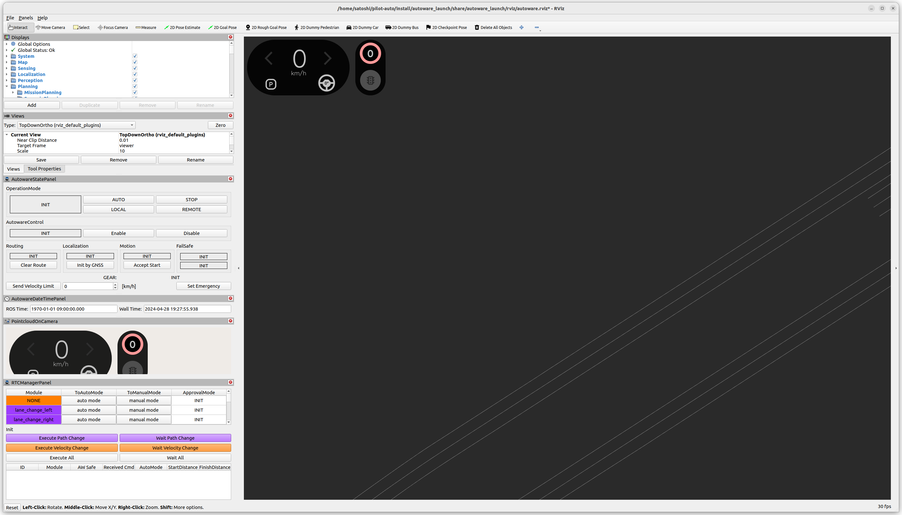
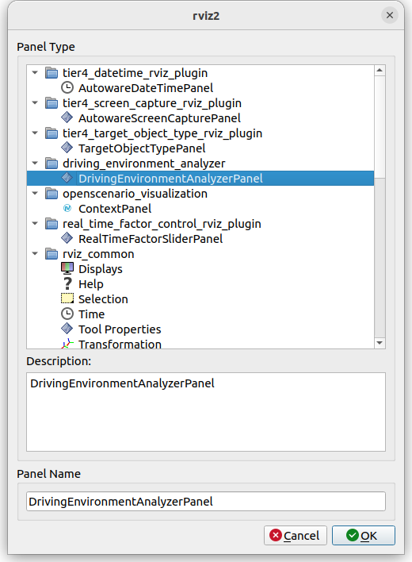
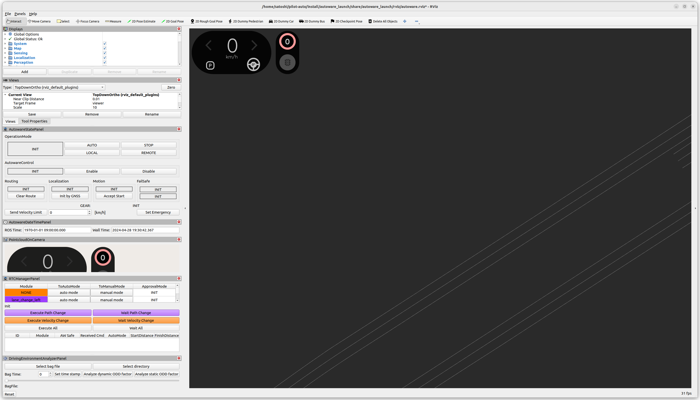
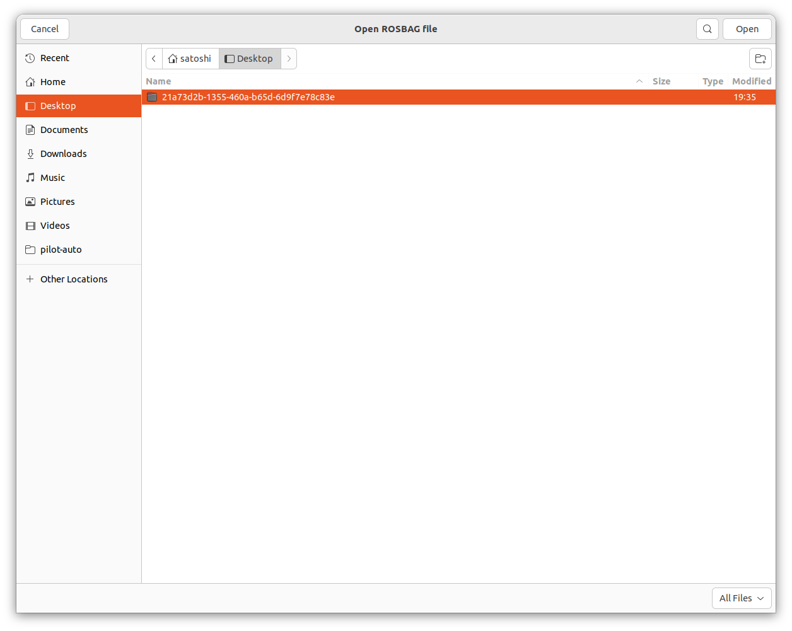
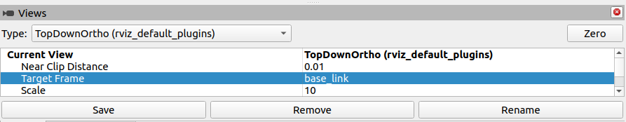
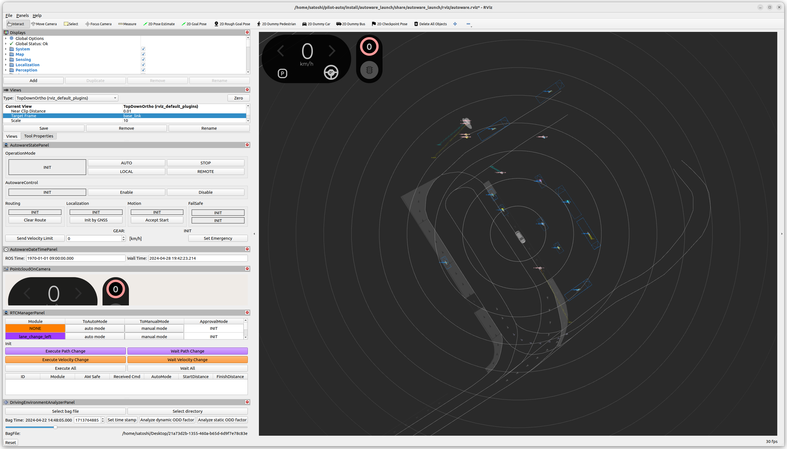

# Driving Environment Analyzer

このツールはROSBAGに含まれる走行履歴を元に走行環境のODDを解析するツールです。

## ROSBAGの特定時刻における周囲のODDを解析する場合

この場合にはRvizプラグインである`driving_environment_analyzer_rviz_panel`を使用することをおすすめします。

現在以下の情報が出力可能です。

- EGOの現在車速
- 現在位置の勾配
- EGOの挙動
- 現在の車線情報

こちらのツールはautoware_launchに含まれる`logging_simulator`を使用します。まず以下のコマンドからシミュレータを起動してください。

`ros2 launch autoware_launch logging_simulator.launch.xml map_path:=<MAP> vehicle_model:=<VEHICLE_NAME> sensor_model:=<AIP_NAME> sensing:=false control:=false planning:=false perception:=false localization:=false system:=false`



シミュレータ起動時に地図を読み込むためROSBAGに地図情報が含まれていなくてもODDの解析が可能です。（ただし、その場合にはROSBAG取得の際に使用した地図を指定してシミュレータを起動するようにしてください。）

次に本パッケージに含まれる解析ツールを起動します。Rviz画面左上部のAdd New PanelからDrivingEnvironmentAnalyzerPanelを選択してください。これでRviz左下に新しく操作パネルが追加されます。




本ツールはROSBAGファイル指定してロードできる他、複数のROSBAGファイルが格納されているディレクトリを指定することも可能です。ただし、その場合には事前に以下のコマンドで`metadata.yaml`の生成が必要になります。

`ros2 bag reindex <DIR_PATH> sqlite3`



ROSBAGの読み込みが完了したらODDを解析したい時刻を指定します。時刻の指定にはUnix timeを直接指定するほかスライドバーも使用可能です。左に表示されている日時を参考に調整してください。


また、このときViewsのTarget Flameを`base_link`にしておくことで、指定した時刻のEGOの位置と周囲の状況をRvizで可視化可能です。



時刻の指定が完了したら、`Set time stamp`ボタンを押し、最後に`Analyze dynamic ODD factor`を押すことで解析が始まります。



```bash
[rviz2-11] ***********************************************************
[rviz2-11]                    ODD analysis result
[rviz2-11] ***********************************************************
[rviz2-11] Type: TIME SPECIFIED
[rviz2-11] Time: 2024-04-22 14:48:05
[rviz2-11]
[rviz2-11]
[rviz2-11] - EGO INFO
[rviz2-11]   [SPEED]                       : 0 [m/s]
[rviz2-11]   [ELEVATION ANGLE]             : 0.00963597 [rad]
[rviz2-11]
[rviz2-11] - EGO BEHAIOVR
[rviz2-11]   [AVOIDANCE(R)]                : NONE
[rviz2-11]   [AVOIDANCE(L)]                : NONE
[rviz2-11]   [LANE_CHANGE(R)]              : NONE
[rviz2-11]   [LANE_CHANGE(L)]              : NONE
[rviz2-11]   [START_PLANNER]               : SAFE: true COMMAND: deactivate
[rviz2-11]   [GOAL_PLANNER]                : NONE
[rviz2-11]   [CROSSWALK]                   : NONE
[rviz2-11]   [INTERSECTION]                : NONE
[rviz2-11]
[rviz2-11] - LANE INFO
[rviz2-11]   [ID]                          : 176126
[rviz2-11]   [WIDTH]                       : 4.24132 [m]
[rviz2-11]   [SHAPE]                       : STRAIGHT
[rviz2-11]   [RIGHT LANE NUM]              : 0
[rviz2-11]   [LEFT LANE NUM]               : 0
[rviz2-11]   [TOTAL LANE NUM]              : 1
[rviz2-11]   [SAME DIRECTION LANE]         : NONE
[rviz2-11]   [OPPOSITE DIRECTION LANE]     : NONE
[rviz2-11]   [ROAD SHOULDER]               : EXIST
[rviz2-11]
[rviz2-11] - SURROUND OBJECT NUM
[rviz2-11]   [UNKNOWN]                     : 0
[rviz2-11]   [CAR]                         : 6
[rviz2-11]   [TRUCK]                       : 0
[rviz2-11]   [BUS]                         : 3
[rviz2-11]   [TRAILER]                     : 2
[rviz2-11]   [MOTORCYCLE]                  : 0
[rviz2-11]   [BICYCLE]                     : 0
[rviz2-11]   [PEDESTRIAN]                  : 7
[rviz2-11] ***********************************************************
```

## ROSBAG全体に対して経路沿いのODDを解析する場合

現在以下の情報が出力可能です。

- 走行経路の長さ
- 走行経路の車線情報
- 走行経路の最大・最小勾配
- 走行経路の最大曲率
- 走行経路の最大・最小車線幅
- 交差点の有無
- 信号機の有無
- 横断歩道の有無

起動時に`bag_path`オプションで解析したいROSBAGを指定してください。（ディレクトリの指定も.db3ファイルの直接指定もサポートしています。）

解析に必要なtopicは以下のとおりです。（今後増える可能性もあります。）

- `/planning/mission_planning/route`
- `/map/vector_map`

以下のようにlaunchすることでODDの解析結果が得られます。

`ros2 launch driving_environment_analyzer driving_environment_analyzer.launch.xml use_map_in_bag:=true bag_path:=<ROSBAG>`

```bash
[component_container-1] [INFO 1708999777.768870564] [driving_environment_analyzer]: ======================================
[component_container-1] [INFO 1708999777.768922452] [driving_environment_analyzer]:  data is ready. start ODD analysis...
[component_container-1] [INFO 1708999777.768933574] [driving_environment_analyzer]: ======================================
[component_container-1] [INFO 1708999777.768967412] [driving_environment_analyzer]: - Length of total lanes : 2357.50 [m]
[component_container-1] [INFO 1708999777.769031174] [driving_environment_analyzer]: - Length of lane that has adjacent lane : 2080.43 [m]
[component_container-1] [INFO 1708999777.769076141] [driving_environment_analyzer]: - Length of lane that has opposite lane : 0.00 [m]
[component_container-1] [INFO 1708999777.769101793] [driving_environment_analyzer]: - Length of lane that has no adjacent lane : 277.07 [m]
[component_container-1] [INFO 1708999777.769225729] [driving_environment_analyzer]: - Min lane width: 3.14 [m] Max lane width: 4.94 [m]
[component_container-1] [INFO 1708999777.769278698] [driving_environment_analyzer]: - Max curvature: 0.007967 [1/m]
[component_container-1] [INFO 1708999777.769293161] [driving_environment_analyzer]: - Min curve radius: 125.52 [m]
[component_container-1] [INFO 1708999777.769336094] [driving_environment_analyzer]: - Min elevation angle: -0.033037 [rad] Max elevation angle: 0.026073 [rad]
[component_container-1] [INFO 1708999777.769403870] [driving_environment_analyzer]: - Min speed limit: 13.89 [m/s] Max speed limit: 16.67 [m/s]
[component_container-1] [INFO 1708999777.769424648] [driving_environment_analyzer]: - Exist traffic light: true
[component_container-1] [INFO 1708999777.769435813] [driving_environment_analyzer]: - Exist intersection: true
[component_container-1] [INFO 1708999777.769620035] [driving_environment_analyzer]: - Exist crosswalk: true
[component_container-1] [INFO 1708999777.769634980] [driving_environment_analyzer]: ======================================
[component_container-1] [INFO 1708999777.769642769] [driving_environment_analyzer]:  complete ODD analysis. shutdown.
[component_container-1] [INFO 1708999777.769650034] [driving_environment_analyzer]: ======================================
```

ただし、`map/vector_map`に関しては`use_map_in_bag`を`false`にすることでローカル環境に保存されている地図を使用してODD解析を行うことも可能です。その場合、`map_path`オプションで地図のパスを指定してください。

`ros2 launch driving_environment_analyzer driving_environment_analyzer.launch.xml use_map_in_bag:=false map_path:=<MAP> bag_path:=<ROSBAG>`

以上のようにオプションを指定することでROSBAGに地図情報が保存されていなくてもODD解析が可能です。
