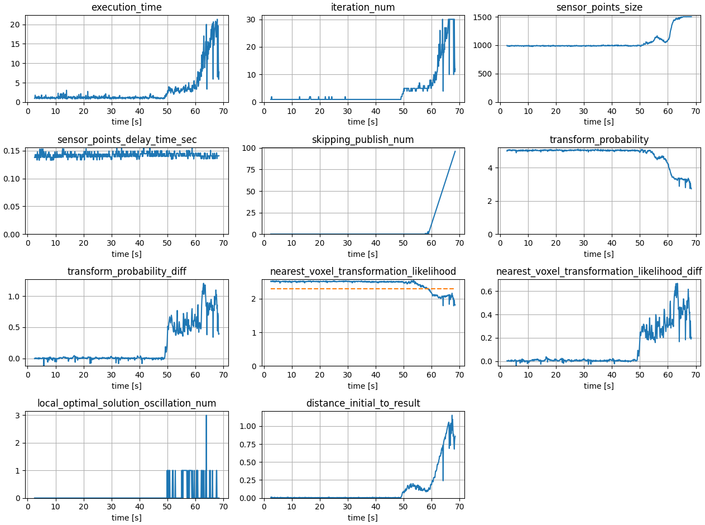

# autoware_localization_evaluation_scripts

This package contains some scripts for evaluating the localization of Autoware.

The scripts are used for the result rosbags of localization, particularly the result_bag from `driving_log_replayer_v2`.

<https://tier4.github.io/driving_log_replayer_v2/quick_start/setup/>

As a test, execute `driving_log_replayer_v2` with the following command:

```bash
ros2 launch driving_log_replayer_v2 driving_log_replayer_v2.launch.py \
    scenario_path:=$HOME/driving_log_replayer_v2/localization.yaml
```

Then, use the scripts for processing the result_bag:

```bash
$HOME/driving_log_replayer_v2/out/latest/result_bag
```

## plot_diagnostics.py

```bash
ros2 run autoware_localization_evaluation_scripts plot_diagnostics.py \
   <rosbag_path> \
   --save_dir=/your/path (default:rosbag_path/../)
```

[Example]

```bash
$ ros2 run autoware_localization_evaluation_scripts plot_diagnostics.py \
    $HOME/driving_log_replayer_v2/out/latest/result_bag
[INFO] [1740561002.740748735] [rosbag2_storage]: Opened database '$HOME/driving_log_replayer_v2/out/latest/result_bag/result_bag_0.db3' for READ_ONLY.
save_dir=PosixPath('$HOME/driving_log_replayer_v2/out/latest/diagnostics_result')
```

This command outputs each diagnostic (tsv) and plot result (png).

```bash
$ tree $HOME/driving_log_replayer_v2/out/latest/diagnostics_result
$HOME/driving_log_replayer_v2/out/latest/diagnostics_result
├── gyro_bias_validator__gyro_bias_validator.png
├── gyro_bias_validator__gyro_bias_validator.tsv
├── localization__ekf_localizer.png
├── localization__ekf_localizer.tsv
├── localization__pose_instability_detector.png
├── localization__pose_instability_detector.tsv
├── localization_error_monitor__ellipse_error_status.png
├── localization_error_monitor__ellipse_error_status.tsv
├── ndt_scan_matcher__scan_matching_status.png
└── ndt_scan_matcher__scan_matching_status.tsv

0 directories, 10 files
```

[Example : ndt_scan_matcher__scan_matching_status.png]



## extract_pose_from_rosbag.py

```bash
ros2 run autoware_localization_evaluation_scripts extract_pose_from_rosbag.py \
   <rosbag_path> \
   --save_dir=/your/path (default:rosbag_path/../)
```

[Example]

```bash
$ ros2 run autoware_localization_evaluation_scripts extract_pose_from_rosbag.py \
    $HOME/driving_log_replayer_v2/out/latest/result_bag \
    --target_topics "/localization/kinematic_state" \
                    "/localization/pose_estimator/pose_with_covariance"
```

This command outputs tsv files for each pose.

The file names are the topic names with “/” replaced with “\_\_”.

```bash
$ tree $HOME/driving_log_replayer_v2/out/latest/pose_tsv
$HOME/driving_log_replayer_v2/out/latest/pose_tsv
├── localization__kinematic_state.tsv
└── localization__pose_estimator__pose_with_covariance.tsv

0 directories, 2 files
```

## compare_trajectories.py

```bash
ros2 run autoware_localization_evaluation_scripts compare_trajectories.py \
   <tsv_file_subject> <tsv_file_reference>
```

[Example]

```bash
$ ros2 run autoware_localization_evaluation_scripts compare_trajectories.py \
    $HOME/driving_log_replayer_v2/out/latest/pose_tsv/localization__kinematic_state.tsv \
    $HOME/driving_log_replayer_v2/out/latest/pose_tsv/localization__pose_estimator__pose_with_covariance.tsv
```

This command outputs tsv files for each pose.

```bash
$ tree $HOME/driving_log_replayer_v2/out/latest/pose_tsv/localization__kinematic_state_result
$HOME/driving_log_replayer_v2/out/latest/pose_tsv/localization__kinematic_state_result
├── compare_trajectories.png
├── relative_pose.png
├── relative_pose.tsv
└── relative_pose_summary.tsv

0 directories, 4 files
```

## diagnostics_flag_check.py

```bash
ros2 run autoware_localization_evaluation_scripts diagnostics_flag_check.py \
   <path_to_scenario_file> <directory_to_diagnostics_result>
```

[Example]

```bash
$ ros2 run autoware_localization_evaluation_scripts diagnostics_flag_check.py \
    ./scenario.yml \
    $HOME/driving_log_replayer_v2/out/latest/result_archive/diagnostics_result
```

This command checks whether a diagnostics have been positive/negative at a specific timing.
The diagnostics flag to observe should be defined in the input scenario file in the format like below.

```yaml
Evaluation:
  Conditions:
    DiagnosticsFlagCheck:
      pose_is_passed_delay_gate:
        flag1:
          type: positive
          timing: at
          sec: 113
          nanosec: 750000000
          window: 500000000
          entirely: false
        flag2:
          type: negative
          timing: before
          sec: 110
          nanosec: 0
          entirely: true
```

A diagnostics can have multiple flags and each flag should have the following fields. (Some have exceptions)

| Key      | Expected value             | Description                                                                                                                                                                                                                                                                                                                                                                                                                                                                                                                                                                                                                                                                                     |
| -------- | -------------------------- | ----------------------------------------------------------------------------------------------------------------------------------------------------------------------------------------------------------------------------------------------------------------------------------------------------------------------------------------------------------------------------------------------------------------------------------------------------------------------------------------------------------------------------------------------------------------------------------------------------------------------------------------------------------------------------------------------- |
| type     | "positive" or "negative"   | Whether the diagnostics is expected to be "positive" or "negative". "positive" means that the diagnostics is ERROR or WARN, and "negative" is not.                                                                                                                                                                                                                                                                                                                                                                                                                                                                                                                                              |
| timing   | "before", "after", or "at" | This defines the time window to check whether the diagnostics is "positive" or "negative". If the type is "positive" and there was a positive diagnostics in the time window the flag check passes, and the flag check fails if not. If the timing is set to "before", the time window starts from the beginning of the rosbag and ends to the time defined by `sec` and `nanosec`. If the timing is set to "after", the time window starts from the time defined by `sec` and `nanosec` and ends to the finish of the rosbag. If the timing is set to "at", the time window will be `-window` nanoseconds to `+window` nanoseconds with the time defined by `sec` and `nanosec` on the center. |
| sec      | int                        | The base time to define the time window with `nanosec`. The `sec` part in ROS time must be filled.                                                                                                                                                                                                                                                                                                                                                                                                                                                                                                                                                                                              |
| nanosec  | int                        | The base time to define the time window with `sec`. The `nanosec` part in ROS time must be filled.                                                                                                                                                                                                                                                                                                                                                                                                                                                                                                                                                                                              |
| window   | int                        | The nanoseconds of the half wing of the time window. Only used when the `timing` is "at", and it is removable if you are using "before" or "after".                                                                                                                                                                                                                                                                                                                                                                                                                                                                                                                                             |
| entirely | bool                       | Whether the target diagnostics should be positive/negative in the entire time window. It is removable and it will be set as "false" by default.                                                                                                                                                                                                                                                                                                                                                                                                                                                                                                                                                 |

This example means that the diagnostics `pose_is_passed_delay_gate` should rise at 113.75 sec in ROS time. To be more specific, the flag should be positive somewhere within a time window of +/- 0.5 seconds around the target time. Besides, the diagnostics should be negative until it reach 110.0 sec in ROS time.

Currently this script supports the following diagnostics. See the actual script to know the concrete definition of positive/negative.

| Key                                     | diagnostics                                      |
| --------------------------------------- | ------------------------------------------------ |
| pose_no_update_count                    | localization: ekf_localizer                      |
| pose_is_passed_delay_gate               | localization: ekf_localizer                      |
| is_initial_pose_reliable                | pose_initializer: pose_initializer_status        |
| imu_time_stamp_dt                       | gyro_odometer: gyro_odometer_status              |
| vehicle_twist_time_stamp_dt             | gyro_odometer: gyro_odometer_status              |
| nearest_voxel_transformation_likelihood | ndt_scan_matcher: scan_matcher_status            |
| localization_error_ellipse              | localization_error_monitor: ellipse_error_status |
| pose_instability                        | localization: pose_instability_detector          |

## analyze_rosbags_parallel.py

```bash
ros2 run autoware_localization_evaluation_scripts analyze_rosbags_parallel.py \
   <result_dir> --parallel_num 2
```

[Example]

```bash
$ ros2 run autoware_localization_evaluation_scripts analyze_rosbags_parallel.py \
    $HOME/driving_log_replayer_v2/out/ \
    --parallel_num 2 \
    --topic_subject "/localization/kinematic_state" \
    --topic_reference "/localization/pose_estimator/pose_with_covariance"
```

This command performs the above three analysis on the subdirectories of the target directory and outputs the results regarding the following criteria.
You can see the results in a JSON file named `summary.json`.

| Criterion                      | Description                                                                                      | Success Condition/Threshold |
| ------------------------------ | ------------------------------------------------------------------------------------------------ | --------------------------- |
| mean_relative_position         | The mean difference of position calculated through `compare_trajectories.py`                     | < 0.5 [m]                   |
| mean_relative_angle            | The mean difference of angle calculated through `compare_trajectories.py`                        | < 0.5 [deg]                 |
| mean_relative_linear_velocity  | The mean difference of linear velocity calculated through `compare_trajectories.py`              | < 0.05 [m/s]                |
| mean_relative_angular_velocity | The mean difference of angular velocity calculated through `compare_trajectories.py`             | < 0.05 [rad/s]              |
| mean_relative_acceleration     | The mean difference of linear acceleration calculated through `compare_trajectories.py`          | < 0.5 [m/s^2]               |
| diagnostics_not_ok_rate        | Check whether diagnostics collect by `plot_diagnostics.py` has low percentages of non-ok status. | < 5.0 [%]                   |

`analyze_rosbags_parallel.py` has an optional argument `--scenario_file` to pass a scenario file (formatted by Driving Log Replayer) to the script.
If the scenario file has a condition named `OverallCriteriaMask` like below, the script `analyze_rosbags_parallel.py` will skip the criterion if it is set to `false`.
The `OverallCriteriaMask` block must be under `Evaluation -> Conditions`. **Note that the scenario file is not required** and the script will automatically set the mask to `true` if no scenario file is given OR there is no `OverallCriteriaMask` in the scenario file.

```yaml
Evaluation:
  Conditions:
    OverallCriteriaMask:
      mean_relative_position: false
      mean_relative_angle: false
      mean_relative_linear_velocity: true
      mean_relative_angular_velocity: true
      mean_relative_acceleration: false
      diagnostics_not_ok_rate: false
```

[Example]

```bash
$ ros2 run autoware_localization_evaluation_scripts analyze_rosbags_parallel.py \
    $HOME/driving_log_replayer_v2/out/ \
    --parallel_num 2 \
    --topic_subject "/localization/kinematic_state" \
    --topic_reference "/localization/pose_estimator/pose_with_covariance" \
    --scenario_file /path/to/scenario.yml
```
