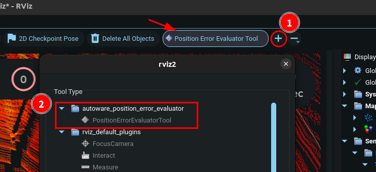
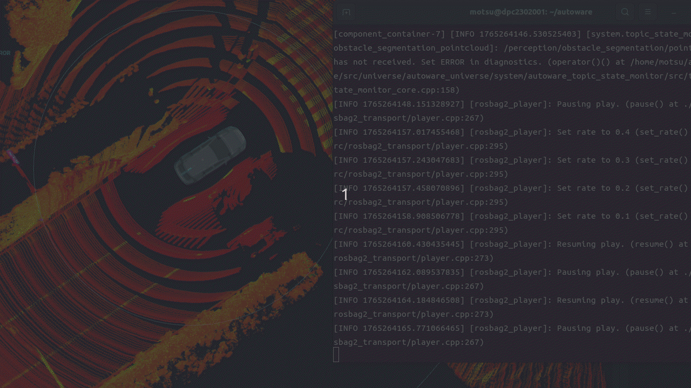

# Position Error Evaluator

## Overview

This RViz plugin tool evaluates vehicle position error by measuring deviations from Lanelet2 map lane boundaries and stop lines. It provides interactive line-based measurement functionality with automatic CSV logging and screenshot capture capabilities.

## Features

- **Interactive Line Measurement**: Click-and-drag interface to measure position errors in RViz
- **Dual Line Type Support**:
  - **Stop Line Measurement**: Measures X-axis error (longitudinal deviation) from stop lines
  - **Lane Boundary Measurement**: Measures Y-axis error (lateral deviation) from lane boundaries
- **Automatic CSV Export**: Timestamped CSV files with measurement data
- **Screenshot Integration**: Automatic desktop screenshot capture after each measurement
- **Real-time Error Display**: Visual feedback with colored line indicators
- **Lanelet2 Integration**: Uses HD map data for accurate reference line detection

## Prerequisites

- RViz2 and rviz_common
- Lanelet2 libraries
- Autoware map messages
- LL2 map which accuracy must match the desired precision, and the correct relationships between objects are essential.
- Rosbag data for vehicle pose playback

- **System Dependencies**:
  - ImageMagick (`import` command for screenshots)
  - X11 display server
  - Qt5 development libraries(autoware usually includes these)

```bash
# Install system dependencies
sudo apt install imagemagick x11-apps
```

## Build Instructions

Adding the usual Autoware installation and build instructions, please do vcs import the repository and build the package.

```bash
vcs import < tools.repos
source /opt/ros/humble/setup.bash
rosdep install -y --from-paths src --ignore-src --rosdistro $ROS_DISTRO
rosdep update
colcon build --packages-up-to autoware_position_error_evaluator
```

## Usage

### Basic Operation

1. **Launch RViz** with Autoware
2. **Add the Tool**:
   - Go to RViz toolbar
   - Add "Position Error Evaluator Tool"(the arrow icon pointed in the image below)
     1. Click "Add Tool" button (#1 in the image)
     2. Select "PositionErrorEvaluatorTool" from the list pop-up (#2 in the image)
     <p align="center">
     
     </p>
3. **Load Map Data**: Ensure Lanelet2 map is loaded in RViz
4. **Start Measuring**:
   - Click to start the following line measurement
   - Click again to complete measurement
   - Right-click to cancel current measurement
   - Delete key to remove last measurement

### Measurement Types

#### Stop Line Measurement

- Click near a stop line in the map
- Tool automatically detects the closest stop line
- Measures X-error (longitudinal deviation)
- Output: `x_error`, `NaN`, `NaN`

<p align="center">

</p>

#### Lane Boundary Measurement

- Click near a lane boundary
- Tool detects the closest lane boundary
- Measures Y-error (lateral deviation)
- Output: `NaN`, `y_error`, `yaw_error`

<p align="center">

</p>

## Inputs

| Name                            | Type                                    | Description      |
| ------------------------------- | --------------------------------------- | ---------------- |
| `/map/vector_map`               | `autoware_map_msgs::msg::LaneletMapBin` | vector map topic |
| `/localization/kinematic_state` | `nav_msgs::msg::Odometry`               | self pose topic  |

## Outputs

### CSV Files

#### measurement CSV

The tool generates CSV files with the following format:

```csv
measurement_number,x_error,y_error,yaw_error
1,0.123456,NaN,2.345678
2,NaN,0.567890,1.234567
```

- `measurement_number`: Sequential measurement counter
- `x_error`: Longitudinal error in meters (stop line measurements)
- `y_error`: Lateral error in meters (lane boundary measurements)
- `yaw_error`: Angular error in degrees
- `NaN`: Not applicable for the measurement type

#### trajectory CSV

To show the measured points, the tool generates trajectory CSV files with the following format:

```csv
x,y,z,yaw
1.0,2.0,0.0,0.0
1.1,2.1,0.0,0.1
```

- `x`, `y`, `z`: Vehicle position in meters
- `yaw`: Vehicle orientation in radians

### Screenshot Naming

Screenshots are automatically captured and named as:
`measurement_YYYYMMDD_HHMMSS_NN.png`
where NN is the zero-padded measurement number.

### File Structure

```Text
~/autoware_position_error_evaluator/
├── position_error_evaluation_YYYYMMDD_HHMMSS.csv
├── trajectory_YYYYMMDD_HHMMSS.csv
└── screenshots_YYYYMMDD_HHMMSS/
    ├── measurement_YYYYMMDD_HHMMSS_01.png
    ├── measurement_YYYYMMDD_HHMMSS_02.png
    └── ...
```

## Line Detection Algorithm

1. **Perpendicular Foot Calculation**: Finds closest point on reference line
2. **Least Squares Fitting**: Improves line segment accuracy
3. **Error Computation**: Calculates perpendicular distance and angular deviation
4. **Type Classification**: Automatically determines stop line vs lane boundary

## File Management

- Automatic directory creation
- Timestamp-based file naming
- Collision avoidance with sequential numbering
- Immediate CSV flush for data safety

## Configuration Parameters

| Name                    | Type   | Description                                           | Default value |
| ----------------------- | ------ | ----------------------------------------------------- | ------------- |
| LINE_WIDTH_MAIN         | double | Line width for main measurement lines (meters)        | 0.3           |
| LINE_WIDTH_LANE         | double | Line width for lane boundary lines (meters)           | 0.15          |
| ANGLE_THRESHOLD_DEGREES | double | Angular threshold for line segment matching (degrees) | 5.0           |

## Automatic Configuration

The tool automatically configures output directories and filenames based on system timestamp. No additional configuration files are required.

## Troubleshooting

### Screenshot Issues

```bash
# Test ImageMagick installation
import -window root test_screenshot.png

# Check X11 access
echo $DISPLAY
xhost +local:
```

### CSV File Issues

- Check write permissions in home directory
- Verify disk space availability
- Ensure proper ROS 2 environment setup

### Map Detection Issues

- Verify Lanelet2 map is properly loaded
- Check map topic subscription
- Ensure vehicle pose is being published
