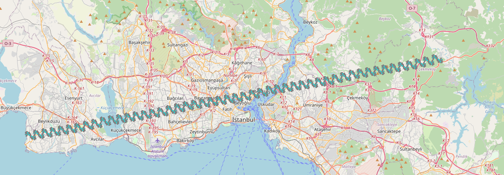

# autoware_lanelet2_divider

This is a lanelet2 tile generator tool for Autoware dynamic lanelet2 map loading feature.

Working principal of this tool is sequentially:

- Take the inputs from the user
- Generate square grids according to the input MGRS grid
- Filter generated square grids with the input lanelet2_map.osm
- Generate map tiles from filtered grids and input lanelet2_map.osm with Osmium Tool

- [autoware_lanalet2_divider](#autoware_lanalet2_divider)
  - [System Requirements](#system-requirements)
  - [Inputs](#inputs)
    - [MGRS Grid](#mgrs-grid)
    - [Grid Edge Size](#grid-edge-size)
    - [Input Lanelet2 Map Path](#input-lanelet2-map-path)
  - [Outputs](#outputs)
    - [lanelet2_map.osm Folder](#lanelet2_maposm-folder)
    - [lanelet2_map_metadata.yaml](#lanelet2_map_metadatayaml)
    - [config.json Files](#configjson-files)
    - [output_layers.gpkg](#output_layersgpkg)
  - [Installation](#installation)
    - [Poetry](#poetry)
    - [Osmium Tool](#osmium-tool)
    - [autoware_lanalet2_divider Python Dependencies](#autoware_lanalet2_divider-python-dependencies)
  - [Running](#running)
  - [Example Data](#example-data)
    - [Yildiz Technical University Original Lanelet2 Map](#yildiz-technical-university-original-lanelet2-map) <!-- cspell: ignore Yildiz -->
    - [Yildiz Technical University Extended Lanelet2 Map (Synthetic)](#yildiz-technical-university-extended-lanelet2-map-synthetic) <!-- cspell: ignore Yildiz -->
  - [Params](#params)

## System Requirements

- [Python](https://www.python.org/) (tested with 3.10)
- [Poetry package](https://python-poetry.org/docs/)
- [Osmium Tool](https://github.com/osmcode/osmium-tool)

## Inputs

### MGRS Grid

100 kilometer MGRS grid that the input lanelet2_map is in. This is needed for generating the grids inside of the
MGRS grid and filtering them.

### Grid Edge Size

This determines the vertex length of the generated map tiles. Map tiles are generated with squares and the edges of
those squares are determined by the user's input.

### Input Lanelet2 Map Path

The full path of the input `lanelet2_map.osm`. This file won't be corrupted.

## Outputs

### lanelet2_map.osm Folder

This is a folder. Autoware's dynamic lanelet2 map loading pipeline needs this folder to find generated map-tiles.
It contains all the generated lanelet2 maps.

### lanelet2_map_metadata.yaml

This metadata file holds the origin points of all the generated lanelet2 map files inside the `lanelet2_map.osm`
folder. Origin point of each lanelet2 map is the coordinates of the left bottom vertex of the corresponding
square created with `mgrs_grid` and `grid_edge_size` parameters.

### config.json Files

Those files contain the coordinates of the vertices of the created squares. With those coordinates, **Osmium Tool**
runs an **extract** operation and divides the input lanelet2_map.osm file.

### output_layers.gpkg

This file contains the geographical visualization for generated data. This is not used in Autoware or somewhere else.
It is generating only for debugging the output files. [QGIS](https://qgis.org/en/site/) can be used for opening this <!-- cspell: ignore QGIS -->
file. You need to see the visualizations of generated grids, filtered grids and input lanelet2 map.

<p align='center'>
    
</p>
<p align='center'>
    
    
</p>

## Installation

Additional to `colcon build`, you have to follow individual installation steps for the tools that are used in this
project.

### Poetry

```bash
pip install poetry
```

### Osmium Tool

<https://github.com/osmcode/osmium-tool?tab=readme-ov-file#building>

```bash
cd <path-to-libraries>
git clone https://github.com/osmcode/osmium-tool.git
cd osmium-tool
mkdir build
cd build
cmake ..
ccmake .  ## optional: change CMake settings if needed
make
```

### autoware_lanelet2_divider Python Dependencies

```bash
cd <path-to-autoware_tools/map/autoware_lanalet2_divider>
pip install -r requirements.txt
```

## Running

Before running the tool, you should check the `config/lanelet2_divider.param.yaml` file. You can change the default
parameters from this file.

```bash
ros2 run autoware_lanelet2_divider lanelet2_divider --ros-args --params-file install/autoware_lanelet2_divider/share/autoware_lanelet2_divider/lanelet2_divider.param.yaml
```

## Example Data

### Yildiz Technical University Original Lanelet2 Map <!-- cspell: ignore Yildiz -->

This is an original lanelet2 map file that contains stop lines, speed bumps or other regulatory elements:
<https://drive.google.com/drive/folders/1VFN0zidAHzIuQCnznVaFzefqqdRS_X5l?usp=drive_link>

<p align='center'>
    
</p>

### Yildiz Technical University Extended Lanelet2 Map (Synthetic) <!-- cspell: ignore Yildiz -->

This is the extended version of the original lanelet2 map file. We extended it to 80 kilometers by hand.
Still it contains all the regulatory elements:
<https://drive.google.com/drive/folders/1CRBYp19_NXzHXxL9JkO_ffbhGARoRaAV?usp=drive_link>

<p align='center'>
    
</p>

## Params

| Param              | Description                                             |
| ------------------ | ------------------------------------------------------- |
| mgrs_grid          | The 100 kilometer MGRS grid that the lanelet2 map is in |
| grid_edge_size     | Wanted edge length in meters for map-tiles to generate  |
| input_lanelet2_map | Full path of the lanelet2_map to divide                 |
| output_folder      | Full path of the output folder to fill                  |
