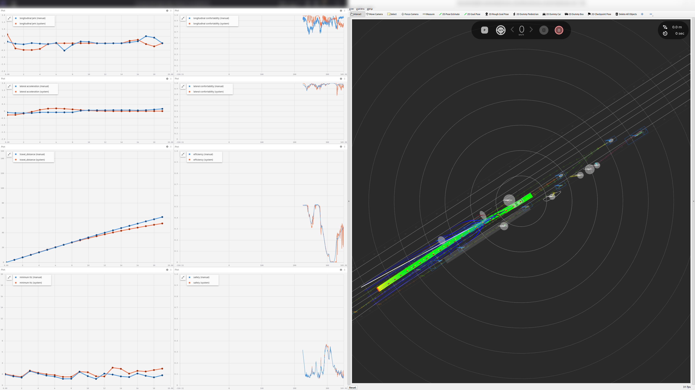

# Planning Data Analyzer

<div align="center">
  
</div>

## Usage

```sh
ros2 launch autoware_planning_data_analyzer behavior_analyzer.launch.xml bag_path:=<ROSBAG>
```

## Output

| Name                      | Type                                              | Description                                                     |
| ------------------------- | ------------------------------------------------- | --------------------------------------------------------------- |
| `~/output/manual_metrics` | `tier4_debug_msgs::msg::Float32MultiArrayStamped` | Metrics calculated from the driver's driving trajectory.        |
| `~/output/system_metrics` | `tier4_debug_msgs::msg::Float32MultiArrayStamped` | Metrics calculated from the autoware output.                    |
| `~/output/manual_score`   | `tier4_debug_msgs::msg::Float32MultiArrayStamped` | Driving scores calculated from the driver's driving trajectory. |
| `~/output/system_score`   | `tier4_debug_msgs::msg::Float32MultiArrayStamped` | Driving scores calculated from the autoware output.             |
