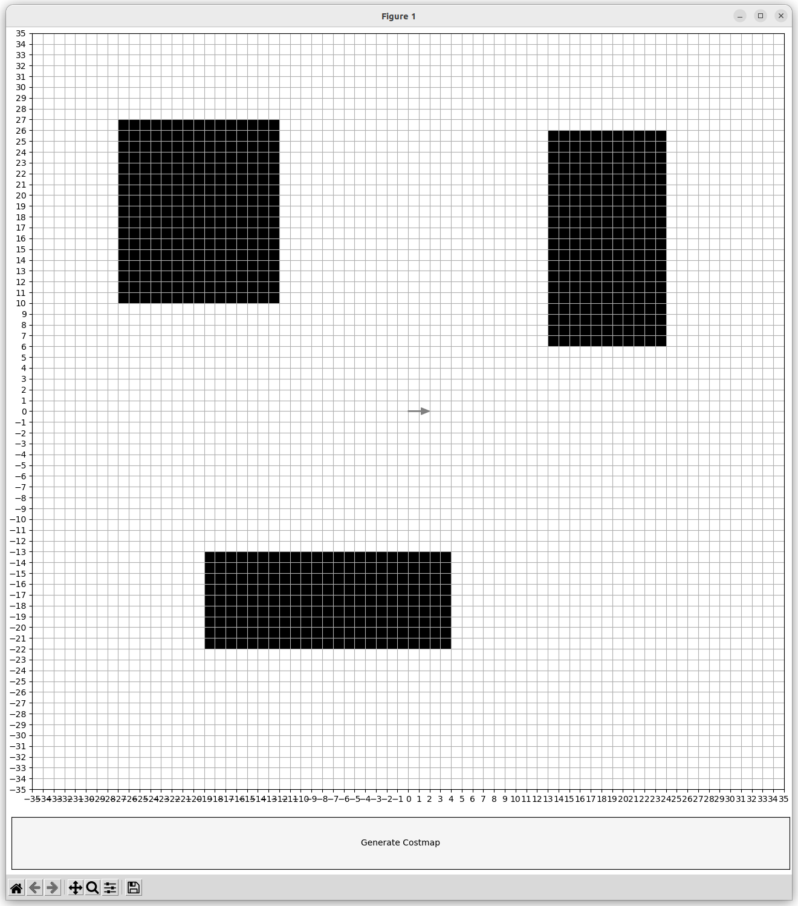
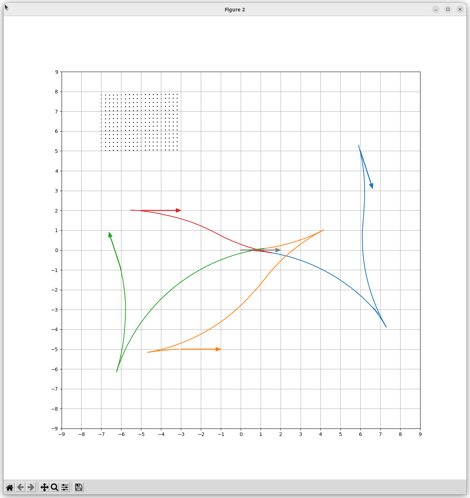
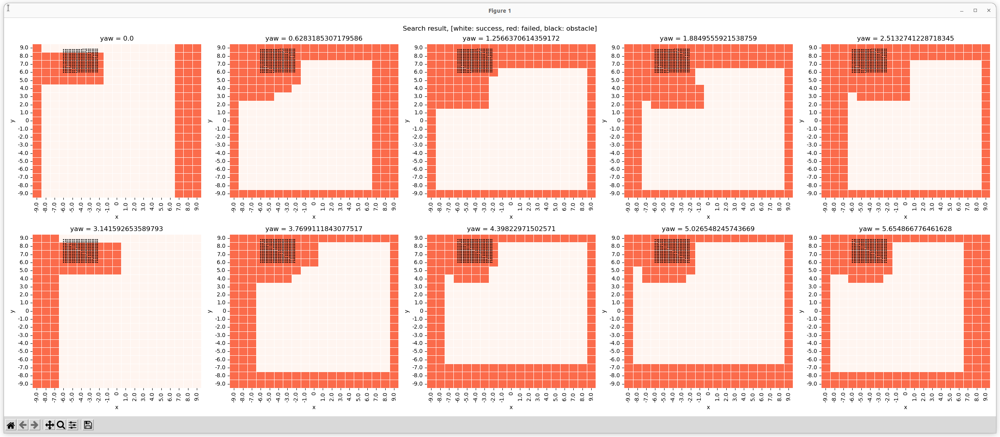

# Parameter tuning tools for freespace planning algorithms

## Setup

1. Move to the target autoware directory and build the package

   ```sh
   colcon build --packages-up-to autoware_freespace_planning_algorithms --symlink-install --cmake-args -DCMAKE_BUILD_TYPE=Release
   ```

2. Source the setup srcript

   ```sh
   source install/setup.bash
   ```

3. Move to this directory and run

   ```sh
   pip3 install .
   ```

## Quick start

1. Select the parameters which is used for the optimization in the [configuration file](config/optimization_config.yaml).

2. Run the bash file with an arbitrary file name.

   ```sh
   ./optimization_operator.sh costmap_default [file name]
   ```

3. You can find the optimized parameter at `opt_param/[file name].yaml`. Substitude the config parameters of freespace planner (in your autoware) into the optimized parameter manually.

Default costmap used for the optimization is below:


## Optimization

### Usage

1. Select the parameters which is used for the optimization in the [configuration file](config/optimization_config.yaml).

2. Run the bash file with an arbitrary file name.

   ```sh
   ./optimization_operator.sh [costmap name] [file name]
   ```

3. You can find the optimized parameter at `opt_param/[file name].yaml`. Substitude the config parameters of freespace planner (in your autoware) into the optimized parameter manually.

### Options

| Option         | Description                                                          | Defualt value   |
| -------------- | -------------------------------------------------------------------- | --------------- |
| `costmap name` | costmap name to use for optimization, generated in the next section. | costmap_default |
| `file name`    | directory name to save the results                                   | test            |

## Costmap generation

### Usage

1. Run the script

   ```sh
   python3 generate_costmap.py --save_name [filename]
   ```

2. Then the GUI shows up
   - Drag and drop to put an obstacle
   - Drag and drop the same points again to remove the obstacle
   - Push "Generate Costmap" button to save the costmap to `costmap/filename.txt`
3. Close the window to finish it



### Options

| Option         | Type   | Description                   | Defualt value     |
| -------------- | ------ | ----------------------------- | ----------------- |
| `--save_name`  | string | file name to save the costmap | costmap_generated |
| `--height`     | int    | height of the costmap         | 350               |
| `--width`      | int    | width of the costmap          | 350               |
| `--resolution` | float  | resolution of the costmap     | 0.2               |

## Search for trajectory to goal on grid

Search for goals on grid: discretized on x, y, yaw axes.

### Usage

1. Run the script

   ```sh
   python3 search.py --save_name [save dir name]
   ```

   or execute in parallel using [eos run-many](https://github.com/iory/eos/blob/master/eos/run_many.py)

   ```sh
   run-many 'python3 search.py --save_name [save dir name]' -n 10 -j 10
   ```

2. Then the trajectories for goals on grid are searched and saved

### Options

| Option           | Type   | Description                                            | Defualt value   |
| ---------------- | ------ | ------------------------------------------------------ | --------------- |
| `--save_name`    | string | directory name to save the results                     | default_dir     |
| `--costmap`      | string | costmap name for search, generated in previous section | costmap_default |
| `--x_resolution` | float  | goal grid sersolution of the x axis [m]                | 1.0             |
| `--y_resolution` | float  | goal grid sersolution of the y axis [m]                | 1.0             |
| `--yaw_discrete` | int    | goal discretize number of yaw                          | 10              |

## Visualize the searched results and the trajectories

### Usage

1. Run the script

   ```sh
   python3 visualize_trajectories.py --save_name [save dir name]
   ```

2. Then the two GUIs show up
   - Viewer of the searched trajectories
     - Drag and drop to put a goal in specified direction
     - Drag and drop the same point and direction again to remove the goal
     - Then the trajectories for put goal are shown
       
   - Viewer of the success or failure of the search
     - White, red, and black cells indicate success, fail, and obstacle cell, respectively.
       
3. Close the windows to finish it

### Options

| Option        | Type   | Description                                                       | Defualt value |
| ------------- | ------ | ----------------------------------------------------------------- | ------------- |
| `--save_name` | string | directory name to save the results, generated in previous section | default_dir   |
