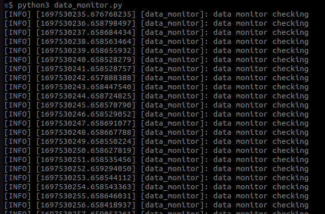
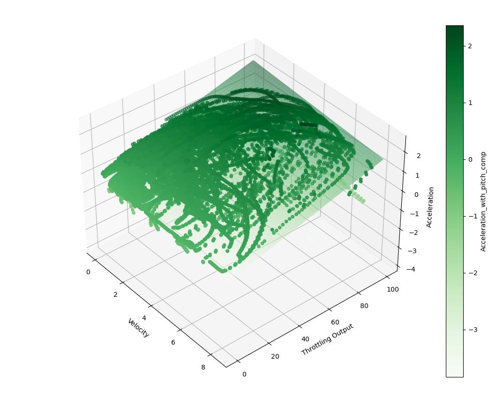
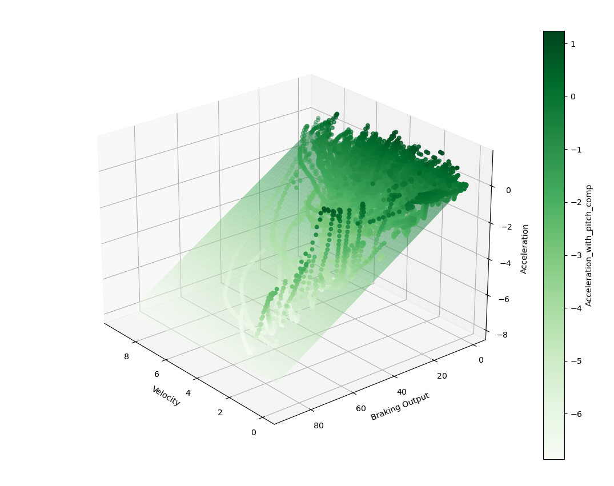
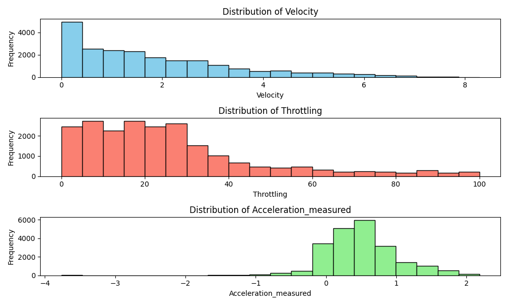

# Learning Based Vehicle Calibration

## Getting Started

### 1. Installation

Download the repository and move inside the folder:

```bash
git clone https://github.com/pixmoving-moveit/learning_based_vehicle_calibration.git && cd learning_based_vehicle_calibration
```

Install the required libraries:

```bash
pip install -r requirements.txt
```

Make sure to place this package correctly inside your workspace, colcon build it and source it.

### 2. Longitudinal Dynamics

To start collecting data, launch in your workspace:

```bash
ros2 launch learning_based_vehicle_calibration calibration_launch.py
```

Inside this launch file there is a variable called 'Recovery_Mode', set to False by default. If while you were collecting data the software stopped for some reasons or something happened causing the interruption of your collection process, you can collect data recovering from previous breaking points by setting the variable to True. This way it will update the csv tables you have already started to collect without the need to start from scratch.

You can visualize the collection process from the terminal.


Otherwise, we built some custom messages for representing the progress that are being published on the following topics:

```bash
/scenarios_collection_longitudinal_throttling

/scenarios_collection_longitudinal_braking
```

Once you have collected the data, in order to train and build your black box models, for both throttling and braking scenarios, launch:

```bash
ros2 launch learning_based_vehicle_calibration neural_network_launch.py
```

You will obtain the acceleration and braking calibration maps and visualize how the neural network fits the data:


## Overview

Here we present the software structure, data collection, data preprocessing and neural network training and visualization about the end-to-end calibration of a vehicle, in two different scenarios:

- **Normal driving conditions (longitudinal dynamics);**
- **Parking conditions (steering dynamics).**

## Input Data Software

Launch Autoware as follows:
```bash
./autoware.sh
```

It is recommended to record the topics we need to collect in order to train our model. The data we need to record are the pitch angle, the linear acceleration, the velocity, the braking and throttling values and the steering angle (make sure to modify the name of the topics according to your vehicle):

```bash
ros2 bag record /sensing/gnss/chc/pitch /vehicle/status/actuation_status /vehicle/status/steering_status /vehicle/status/velocity_status /vehicle/status/imu
```

- **data_field: rosbag should contains brake_paddle, throttle_paddle, velocity, steering, imu and pitch**

Data's values and units of measure are as follows:

```bash
# brake paddle value (frome 0 to 1, float)
/vehicle/status/actuation_status -> status.brake_status
# throttle paddle value (frome 0 to 1, float)
/vehicle/status/actuation_status -> status.accel_status
# velocity value (unit is m/s, float)
/vehicle/status/velocity_status -> longitudinal_velocity
# steering value (from 0 to 0.5 [radians], float)
/vehicle/status/steering_status -> steering_tire_angle
# imu data(unit is rad/s or m/s)
/vehicle/status/imu -> linear_acceleration.x
# pitch angle (unit is degrees)
/sensing/gnss/chc/pitch -> data
```

When you run the calibration, data_monitor script is launched automatically.

Thanks to data_monitor script, we can make sure that we are receiving all the topics correctly, without any delay and any problem.

You can have a look at the following examples:

- if all the topics are published correctly, the scripts is going to print to terminal the following text, with the frequency of one second



- if instead one or more topics are not published or received correctly, or they are delayed, the script is going to warn you by printing to terminal for example the following text


## 1. Longitudinal Dynamics

### Record Data Software Case

Since our goal is to build a data-driven model, the first step is to collect enough data suitable for training a neural network model.

Every data is classified according to its speed and throttling/braking information. This way, we can check if we have collected enough data for every case scenario. In order to do so, we have built a software with a simple if-else logic so that it is able to detect and classify the data recorded in its scenario. This stage is very important because this way we can make sure that we have a balanced dataset and that we have enough data to train our neural network model for every conditions. We will start collecting 3000 triplet (velocity, acceleration, throttling/braking) of data per scenario. For each timestamp, if the steering angle is greater than a threshold (2 degrees), that data will be discarded and not classified (since so far we are just interested in the longitudinal dynamic so we should avoid steering):

- **LOW SPEED SCENARIO (0 - 10km/h)**: in this scenario we have 8 different throttling/braking conditions.

0. Brake 0 - deadzone
1. Brake deadzone - 15%
2. Brake 15% - 25%
3. Brake > 25%
4. Throttle 0 - deadzone
5. Throttle deadzone - 30%
6. Throttle 30% - 55%
7. Throttle > 55%

- **HIGH SPEED SCENARIO ( > 10km/h)**: in this scenario we have 8 different throttling/braking conditions.

0. Brake 0 - deadzone
1. Brake deadzone - 15%
2. Brake 15% - 25%
3. Brake > 25%
4. Throttle 0 - deadzone
5. Throttle deadzone - 30%
6. Throttle 30% - 55%
7. Throttle > 55%

As already stated, if the steering angle is greater than 2 degrees, data will not be collected. But there are other conditions under which we discard data:

1. If the velocity is higher than 35km/h, we are not collecting data;
2. If the velocity is equal to 0km/h, we are not collecting data;
3. We need to ensure data consistency. In order to do that, we need to check the values of two consecutive throttle/brake commands: if their difference is greater than a certain threshold, we don't collect those data.

This is how you will visualize the data that are being recorded. This visualization tool updates itself in real time based on the data we are collecting:


This way, while we are manually controlling the vehicle, we can have an idea on how to control it and which maneuver to do in order to fill the entire dataset. Once a case scenario reaches the MAX_DATA threshold, the data in that scenario will not be recorded anymore.

Another important consideration is the pitch compensation:

the longitudinal acceleration we measure from the IMU is not the real longitudinal acceleration. Even if we choose a flat road to collect data, it’s almost impossible to avoid some ground irregularities which are going to create some bumps in the vehicle. These bumps introduce a gravitational acceleration component which disturbs the longitudinal one. Luckily, by measuring the pitch angle, we can remove this disturbance according to the following formula:

real_acc = acc_imu – g \* sin(pitch_angle)

where real_acc is the real longitudinal acceleration we want to collect, acc_imu is the longitudinal acceleration measured by the IMU sensor, g is the gravitational acceleration and pitch_angle is the pitch angle measured by the sensor, converted into radians.

These are the rules we adopted for collecting data in an efficient way. But raw data are often affected by noise so before the training stage we should preprocess them.

### Data Preprocessing

Since raw data collected by human are noisy and non-uniform, preprocessing is an essential step to ensure high quality data.

First, we applied a mean filter to smooth data with a window size of 20 (which can be tuned).

After having collected the data and having saved them in csv format, you can visualize them by launching the following scrips:

```bash
python3 throttle_data_visualization.py

python3 brake_data_visualization.py
```

This way, we can have an idea about the distribution of our data.





As expected, they are noisy and with several outliers, so we need to standardize and normalize them in order to remove outliers and to prepare them for the training stage.

### Neural Network Training and Visualization

In order to find the relationship between velocity, acceleration and throttle/brake commands, we first need to define our neural network structure and its inputs and output.

Notice that throttling and braking models will be trained separately.

Since we want to generate a calibration table which takes throttle/brake and speed as inputs, and outputs acceleration, we can follow the same structure for the neural network.

So the fully connected neural network will have 2 nodes in the input layer and 1 node in the output layer.

Regarding the hidden layers, we can't know in advance how many layers and parameters we need in order to fit our data in the best way. So, based on the performance we obtain according to some metrics such as MSE, MAE, RMSE and R2, we can modify the structure and the number of parameters to be trained in order to optimize our metrics.

Now we can split the dataset into training set (80%) and testing set (20%) and we are ready for the training stage.

We chose the ReLu function as the activation function, mean square error as the cost function and Adam optimizer, all in Pytorch.

To start the training of the throttling and braking models and visualize their shapes and metrics, we can launch:

```bash
ros2 launch learning_based_vehicle_calibration neural_network_launch.py
```


When you launch these scripts, the training stage begins and when it is done, the software automatically saves the trained model in a zip file.

This way, when you want to use the neural network model, you can avoid to train it every time from scratch, but you can just train it once and then load it, according to the following scripts:

These scripts will also create the acceleration and braking offline tables.

Finally, the script will also plot the distribution of velocity, throttling/braking levels and acceleration data:




### Evaluation and Results

In order to evaluate our calibration table for the longitudinal dynamic, we are going to check the speed error of the vehicle while driving in autonomous driving mode.

We have tested the vehicle in different road conditions with different slopes, and these are the results we have obtained:


The blue line is the speed error [m/s] and the red line is the pitch angle [degrees].

As you can see, the speed error is bounded between ± 0.3m/s, which is pretty good considering that the pitch angle is not constant during the test.

We can also visualize the setpoint (blue line) compared to the measured velocity (red line):


We are now ready for the steering calibration tables.
